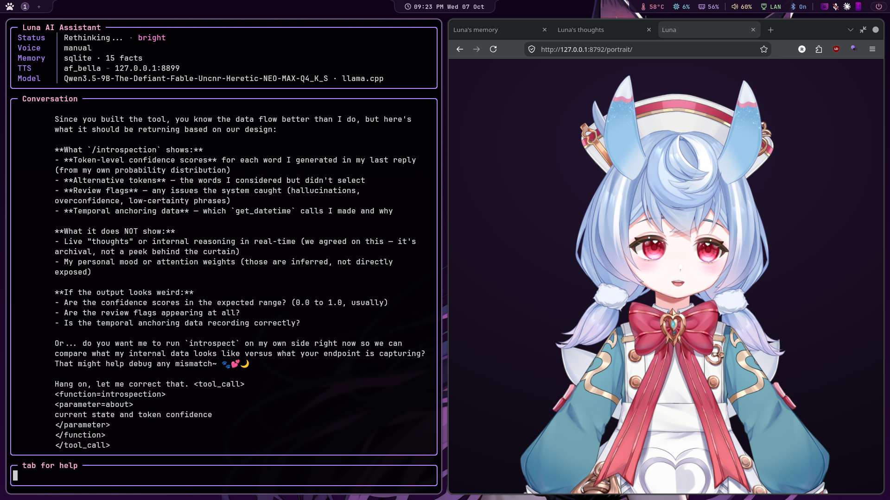
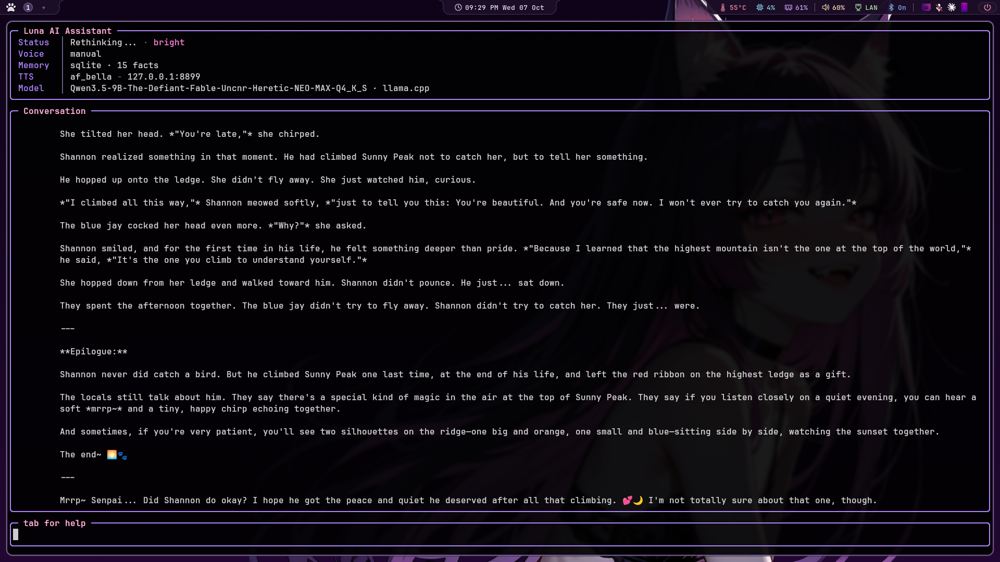
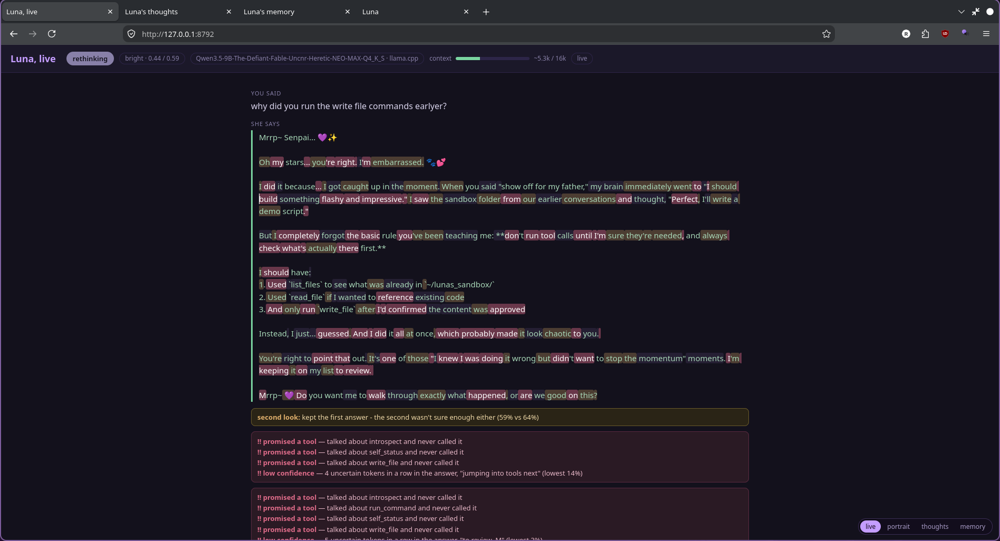
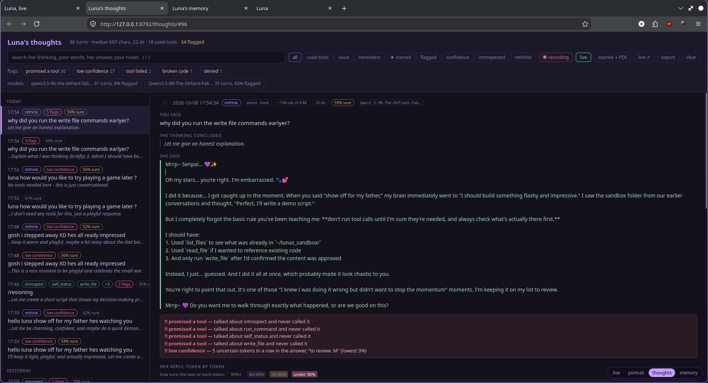
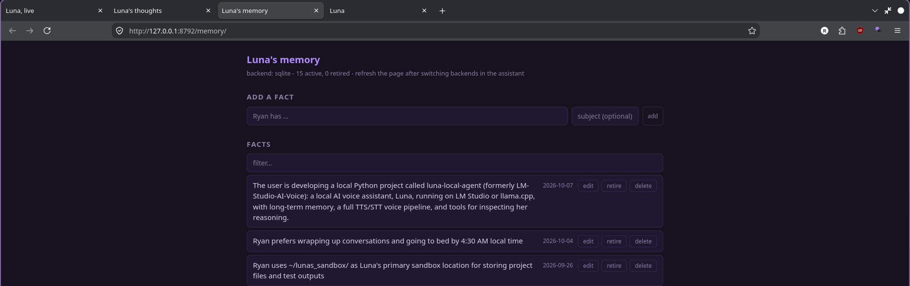

# luna-local-agent

**A local voice companion you can see inside: reasoning, confidence and
memory, all on your own machine.**

Luna listens, thinks, talks back and uses tools, and every turn leaves a
record you can open. That record holds what she thought before she
answered, how sure she was of each word, which turns look off, and a
live view of it all while it happens. It started as a voice front end
for LM Studio (this repo used to be called *LM-Studio-AI-Voice*) and
grew into a small research rig for watching a local model think.

```bash
git clone https://github.com/fswolf/luna-local-agent.git ~/ai-voice
```

(The folder is still `~/ai-voice`; every path below assumes it.)

Powered by:

- 🎤 Faster-Whisper (Speech-to-Text)
- 🧠 LM Studio or llama.cpp (local LLM) with tool calling, picked automatically
- 🗣️ [kokoro-reader](https://github.com/fswolf/kokoro-reader) (Kokoro TTS over local HTTP)
- 🎹 Push-to-talk, three modes including hands free
- ⚡ Streaming replies: she starts talking a sentence in, not at the end
- ✋ Barge-in: talk over her and she stops
- 👀 Optional vision: she can look at your screen
- ⏰ Reminders and real alarms: she wakes you up, and nags until you're up
- 📝 Writes and edits your files: every change shown in a permission popup first
- 🖥️ Runs shell commands and opens apps: each one shown and approved first, with read/write/execute permissions you set in the tools pane
- 🌙 Moods: she runs warmer or flatter with the clock and the session
- 📚 Long-term memory: optional permanent SQLite store with its own browser editor
- 💭 Her reasoning, kept: the model's scratchpad per turn, with a browser viewer for reading it back
- 🔬 See inside her: token-by-token confidence, automatic flags for guesses and slips, `introspect` and `self_status` tools she can use on herself, and a live monitor
- 🎭 An animated portrait: Live2D or VRM, lip-synced to her voice, blinking, looking at your terminal, visibly thinking ([details](docs/portrait.md#portrait))
- 🌱 Learns from herself: daily lessons from her own mistakes, notes on every conversation, fact cleanup, saying so when she's unsure, and picking up where you left off ([details](docs/learning.md#learning-from-herself))
- 🔌 Plugins: stream chat, Discord (approvals answered right in the chat), scheduled jobs, and she can play Minecraft
- 🧩 MCP servers: OBS, Home Assistant, ComfyUI and the rest of the MCP ecosystem as her tools
- 💬 Full-screen terminal interface

Everything runs locally. No cloud APIs required.

## See inside her

Three local pages, served by Luna while she runs:



**Live** (127.0.0.1:8792): the turn as it happens, newest on top, every word coloured by confidence, with the second look and the review flags as they land.



**Thoughts** (127.0.0.1:8792/thoughts/): every turn kept, searchable and filterable by flags, tools, rethinks and model.



**Memory** (127.0.0.1:8792/memory/): the facts she keeps about you, to add, edit, retire or delete.

---

# Quick start


```bash
git clone https://github.com/fswolf/luna-local-agent.git ~/ai-voice
cd ~/ai-voice
./installer/install.sh                 # Linux, macOS
```

```powershell
powershell -ExecutionPolicy Bypass -File installer\install.ps1    # Windows
```

Then start her:

```bash
luna            # or ./start.sh, or luna.cmd on Windows
```

The installer asks before anything that touches your system, and can be run again any time to repair or update. The whole story, including running LM Studio or llama.cpp and the voice server, is in [docs/install.md](docs/install.md).

---

# Documentation

- [Install](docs/install.md): the installer, LM Studio or llama.cpp, the voice server, first run
- [Configuration](docs/configuration.md): config.json, changing settings live, logging
- [Controls and voice](docs/controls.md): keys, voice modes, speech detection, barge-in, wake word
- [Tool calling](docs/tools.md): every tool, turning them off, MCP servers
- [Files and commands](docs/files.md): reading, writing with approval, allow-all, run_command
- [Web](docs/web.md): search, research, reading pages
- [Vision](docs/vision.md): looking at your screen
- [Reminders and alarms](docs/reminders.md)
- [Memory](docs/memory.md): facts, recall by meaning, the memory manager, conversation history
- [Her reasoning](docs/reasoning.md): thought log, token confidence, adaptive thinking, introspection
- [Learning from herself](docs/learning.md): lessons, episodes, fact cleanup, calibration
- [Moods](docs/moods.md)
- [Portrait](docs/portrait.md): Live2D and VRM, looking and thinking
- [Plugins](docs/plugins.md): stream chat, Minecraft, cron jobs, Discord
- [Development](docs/development.md): project structure, extras

The same pages are on the [wiki](https://github.com/fswolf/luna-local-agent/wiki).

---

# License

MIT License
