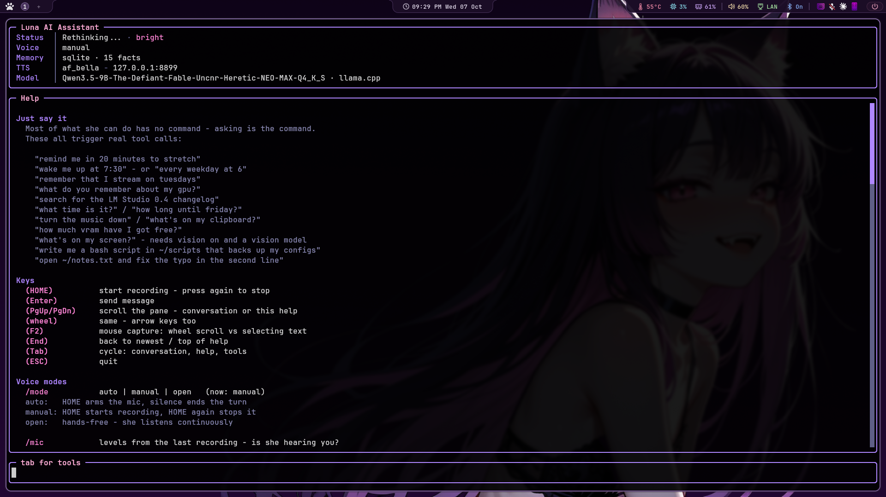

# luna-local-agent

**A local voice companion you can see inside: reasoning, confidence and
memory, all on your own machine.**

Luna listens, thinks, talks back and uses tools, and every turn leaves a
record you can open. That record holds what she thought before she
answered, how sure she was of each word, which turns look off, and a
live view of it all while it happens. It started as a voice front end
for LM Studio (this repo used to be called *LM-Studio-AI-Voice*) and
grew into a small research rig for watching a local model think.

```bash
git clone https://github.com/fswolf/luna-local-agent.git ~/ai-voice
```

(The folder is still `~/ai-voice`; every path below assumes it.)

Powered by:

- 🎤 Faster-Whisper (Speech-to-Text)
- 🧠 LM Studio or llama.cpp (local LLM) with tool calling, picked automatically
- 🗣️ [kokoro-reader](https://github.com/fswolf/kokoro-reader) (Kokoro TTS over local HTTP)
- 🎹 Push-to-talk, three modes including hands free
- ⚡ Streaming replies — she starts talking a sentence in, not at the end
- ✋ Barge-in — talk over her and she stops
- 👀 Optional vision — she can look at your screen
- ⏰ Reminders and real alarms — she wakes you up, and nags until you're up
- 📝 Writes and edits your files — every change shown in a permission popup first
- 🌙 Moods — she runs warmer or flatter with the clock and the session
- 📚 Long-term memory — optional permanent SQLite store with its own browser editor
- 💭 Her reasoning, kept — the model's scratchpad per turn, with a browser viewer for reading it back
- 🔬 See inside her — token-by-token confidence, automatic flags for guesses and slips, an `introspect` tool she can use on herself, and a live monitor
- 🔌 Plugins — stream chat and anything else you bolt on
- 💬 Full-screen terminal interface

Everything runs locally. No cloud APIs required.

---

# Requirements

- Python 3.12+
- LM Studio
- A downloaded language model
- LM Studio Local Server enabled
- [kokoro-reader](https://github.com/fswolf/kokoro-reader) running locally

Speech is **not** synthesized in this process. The assistant is a client
of the kokoro-reader server and stays silent without it.

---

# Create a Virtual Environment

```bash
python3.12 -m venv ai-voice-venv

source ai-voice-venv/bin/activate
```

# Python Dependencies

```text
requests>=2.32.0
numpy>=2.2.0
scipy>=1.15.0
sounddevice>=0.5.2
silero-vad
faster-whisper>=1.1.0
ctranslate2>=4.6.0
kokoro>=0.9.4
torch>=2.8.0
torchaudio>=2.8.0
huggingface_hub>=0.34.0
pynput>=1.8.1
evdev>=1.9.2
prompt_toolkit>=3.0.0
wcwidth>=0.8.2
ddgs>=9.14.4

openwakeword        # optional - "hey Luna" instead of a keypress
```

Install dependencies:

```bash
pip install \
requests \
numpy \
scipy \
sounddevice \
silero-vad \
faster-whisper \
ctranslate2 \
kokoro \
torch \
torchaudio \
huggingface_hub \
pynput \
evdev \
prompt_toolkit \
wcwidth \
ddgs
```

Optional, for the wake word:

```bash
pip install openwakeword
```

`kokoro`, `torch` and `torchaudio` are for the **TTS server**, not the
assistant. If the server has its own venv, the assistant only needs
`requests` to speak.

---

Upgrade pip:

```bash
pip install --upgrade pip
```

---

# Linux Dependencies

## Debian / Ubuntu

```bash
sudo apt install \
python3-dev \
build-essential \
portaudio19-dev \
ffmpeg
```

Optional, for vision on Wayland:

```bash
sudo apt install grim slurp
```

## Fedora

```bash
sudo dnf install \
ffmpeg \
portaudio-devel \
python3-devel \
gcc
```

For vision on Wayland, add `grim` (screenshots) and `slurp` (the region
picker). Both are optional and only needed if you turn vision on.

```bash
sudo dnf install grim slurp
```

---

# macOS Dependencies

Install Homebrew if needed, then:

```bash
brew install portaudio ffmpeg
```

---

# Running LM Studio

1. Install LM Studio
2. Download a model
3. Start the Local Server
4. Verify it is running on:

```
http://localhost:1234
```

---

## Or llama.cpp directly

LM Studio runs llama.cpp underneath but only lets the chat API through.
Running llama.cpp's own server instead serves the same GGUF file and
opens up what LM Studio keeps inside: token probabilities, control
vectors, LoRA adapters, saved KV-cache slots. Luna works with either and
picks by herself at startup, llama-server first if both are up.

```bash
llama/install.sh          # build it - Vulkan; "rocm" for ROCm/HIP instead
llama/start.sh            # serve on 127.0.0.1:8080
./start.sh                # Luna finds it; the header says "· llama.cpp"
```

`install.sh` clones llama.cpp into `llama/llama.cpp/` and builds only
`llama-server` and `llama-bench`, for this card. If a build tool is
missing it prints the exact `dnf install` line and stops. It doesn't
run sudo itself. Vulkan and ROCm builds can sit side by side; `bin/`
points at whichever was built last. Run `llama/bin/llama-bench -m
<model>` under each to see which is faster on your GPU.
`install.sh update` pulls the latest llama.cpp and rebuilds.

`start.sh` reads `llama/server.env`, which holds the same load settings
as LM Studio's model page: context 16384, every layer on the GPU, 9
threads, batch 4096/2048, 4 parallel slots sharing one KV cache, 32
context checkpoints. Edit it there. With `MODEL` left empty it finds the
GGUF in LM Studio's own model folders (the Flatpak's included), so there's no second 10 GB copy.
If LM Studio still has a model loaded it says so, because two copies
won't fit in 16 GB of VRAM. Eject it in LM Studio first.

Thinking comes back in `reasoning_content`, where the thought log
already looks. How much she thinks is `REASONING_BUDGET` in
`server.env` (-1 unlimited, 0 off). `generation.reasoning` in
`config.json` is an LM Studio setting and llama-server ignores it.

Which server she uses:

```json
"llm": {
    "backend": "auto",
    "lmstudio_url": "http://localhost:1234/v1/chat/completions",
    "llama_url":    "http://127.0.0.1:8080/v1/chat/completions"
}
```

`auto` checks once at startup. `lmstudio` or `llama` forces one. To
switch servers mid-session, restart her.

**The key.** The first time `start.sh` runs it makes a random key in
`llama/.api_key` (gitignored, readable only by you) and starts the
server with it, with CORS limited to localhost. Luna reads the same
file and sends it with every request; LM Studio never sees it. Without
it, any web page open in your browser could reach a server on
localhost, and this one can write files (saved slots) and keep the GPU
busy. llama-server's own web page at :8080 will ask for the key too:
paste the contents of `llama/.api_key`.

**Token confidence.** On llama-server every turn also records the
probability of each token she produced, and the top alternatives
whenever she was less than 90% sure. LM Studio doesn't expose this.
See *Her reasoning* below for what the viewer does with it. Switch it
off with `/set thoughts.token_probs false`.

### Recalling facts by meaning

`llama/start.sh` also starts a small embedding model on
127.0.0.1:8081, beside the chat server, whenever it finds one. Its
output goes to `llama/embed.log`, and Ctrl+C stops both.

With more facts than fit in a prompt, she normally picks the ones that
share words with what you said. With the embedding server running she
picks the ones closest in *meaning*, so "I got a new graphics card"
finds the fact about the 6950 XT even though no word is shared. The
newest few facts still always travel, and a fact has to clear a
similarity floor (`llm.embed_min_score`, 0.35) to come along at all.

The model is Qwen3-Embedding-0.6B. Either download it into
`llama/models`:

```bash
mkdir -p ~/ai-voice/llama/models
curl -L -o ~/ai-voice/llama/models/Qwen3-Embedding-0.6B-Q8_0.gguf \
  https://huggingface.co/Qwen/Qwen3-Embedding-0.6B-GGUF/resolve/main/Qwen3-Embedding-0.6B-Q8_0.gguf
```

or search for it in LM Studio and download the Q8_0 GGUF. `start.sh`
looks in both places. It needs about 0.6 GB of VRAM. Without the model,
`start.sh` says so and starts the chat server alone. `EMBED` in
`server.env` is `auto` (start it if found), `off`, or `on` (refuse to
start without it).
Each fact is embedded once and cached in `agent/embeddings.db`; per
turn only what you said is embedded. If the server isn't answering she
goes back to matching words, with nothing to switch.

---

# Running the Kokoro Server

Speech is synthesized by [kokoro-reader](https://github.com/fswolf/kokoro-reader)
rather than loading Kokoro in-process. One loaded model serves every app
that asks, so the assistant starts in seconds instead of waiting on its
own copy.

```bash
git clone https://github.com/fswolf/kokoro-reader.git ~/kokoro-reader

source ~/ai-voice-venv/bin/activate
KOKORO_VOICE=af_bella python3 ~/kokoro-reader/server/kokoro_server.py
```

Check it:

```bash
curl -s localhost:8899/health
curl -s localhost:8899/voices
```

Replies are streamed. Each sentence is sent to the server the moment the
model finishes writing it, so she starts talking about a sentence in
rather than after the whole reply exists — and the next chunk is
synthesized while the current one plays, so there's no gap between them.
Chunks stay under the server's 1200-character limit.

If the server isn't answering, the assistant says so and keeps working
as a text chat.

In `config.json`:

```json
"tts": {
    "url": "http://127.0.0.1:8899",
    "speed": 1.0,
    "volume": 1.0,
    "pitch": 0.0
}
```

`pitch` is in semitones, applied to the audio after it comes back — so
it works with whatever engine is on the port, not just Kokoro. `+3` is
noticeably younger, `-3` older, and past about `±6` it stops sounding
like a person.

It shifts the formants along with the pitch, which is the naive
resample and deliberately so: a formant-preserving shift keeps the same
speaker's identity and only moves the note, which is right for music
and wrong for "give me a younger-sounding character". Moving them
together is what reads as a different person.

```
/set tts.pitch 3
```

applies immediately — no restart, so you can dial it in while she talks.

| Variable | Default | Purpose |
|----------|---------|---------|
| `TTS_URL` | `http://127.0.0.1:8899` | Server address |
| `TTS_VOICE` | `config.json` → `voice` | Voice (`af_bella`, `am_adam`, ...) |
| `TTS_SPEED` | `1.0` | 0.5 – 2.0 |
| `TTS_PITCH` | `0.0` | Semitones. `+3` younger, `-3` older |
| `TTS_VOLUME` | `1.0` | Playback gain |

Environment variables win over `config.json`. The `KOKORO_*` names still
work too, since that's what kokoro-reader itself uses.

## Using a different speech server

Nothing in the assistant is tied to Kokoro. The client speaks a
three-endpoint contract and knows nothing else about what's behind it:

```
POST /tts   {"text": ..., "voice": ..., "speed": ...}  ->  WAV bytes
GET  /health                                           ->  {"ok": true}
GET  /voices                                           ->  the voice list
```

Two things worth knowing if you write your own:

Text arrives **pre-chunked** — split on sentence boundaries, under 1000
characters — and the next chunk is requested while the current one is
still playing. So the server never sees a wall of text and doesn't need
to stream; it just needs to return a sentence's worth of audio promptly.

Audio can come back in **any common WAV format**: 8/16/32-bit integer,
float32, float64, mono or stereo, at any sample rate. The client reads
the header and scales accordingly. That matters because most PyTorch
speech models emit float32, which Python's `wave` module refuses to
open at all.

Point `tts.url` at the new port and nothing else changes.

---

# Run the Assistant

```bash
./start.sh
```

Finds the virtualenv itself, works from any directory, and passes any
arguments through. It checks LM Studio and kokoro-reader on the way past
and *says* if either is down rather than refusing to start — she runs as
a text chat without speech, and a launcher that won't launch is worse
than one that tells you why it'll be quiet.

Or without it:

```bash
source ~/ai-voice-venv/bin/activate
python main.py
```

---

# Configuration

Two files, two jobs.

| File | Holds | You edit it when |
|------|-------|------------------|
| `agent/agent.json` | Who she is — name, personality, tone, traits, rules | You want her to behave differently |
| `config.json` | How the machine runs — voice, models, thresholds, timeouts, theme | You want it to work differently |

They used to be one file, which meant tuning a VAD threshold and
rewriting her personality were the same edit — and you couldn't share
either one without handing over the other.

Where both define a key, `config.json` wins. `agent.json` is still read
as a fallback, so an older install that never split them keeps working
untouched.

Every block in `config.json` is optional and every value has a default
in `config.py`, so a missing block means "use the defaults" rather than
an error. The file that ships has them written out explicitly, because
you can't turn a dial that isn't there.

```json
{
    "voice": "af_bella",
    "generation": { "max_tokens": 4800, "reasoning": "low" },
    "stt":        { ... },
    "tts":        { ... },
    "vision":     { ... },
    "desktop":    { ... },
    "mood":       { ... },
    "files":      { ... },
    "plugins":    { ... },
    "wake_word":  { ... },
    "tools":      { ... },
    "web_search": { ... },
    "reminders":  { ... },
    "alarms":     { ... },
    "history":    { ... },
    "long_term_memory": { ... },
    "thoughts":   { ... },
    "adaptive":   { ... },
    "monitor":    { ... }
}
```

A syntax error in either file is reported and skipped rather than being
fatal — hand-editing them is the whole point of their being JSON.

## Changing settings without leaving the terminal

`/set` lists everything you can change, with its current value:

```
> /set
  [stt]
    stt.barge_in_margin              2.5
    stt.vad_threshold                0.4
    stt.model                        small   (needs a restart)
  [tts]
    tts.speed                        1.0
```

```
> /set stt.barge_in_margin 3.5
stt.barge_in_margin = 3.5 - saved
```

Changes are written to `config.json` immediately, so they survive a
restart. Most take effect at once; the few that don't — a Whisper model
size, a wake word file — say so rather than pretending.

That split is real, not cosmetic. Settings are read once at import and
copied into constants, which is why they can't normally change at
runtime. The ones worth tuning by ear are read from the config module
at the point of use instead, because tuning is a loop of *change it,
say something, listen, change it again* and a restart each time around
makes it useless.

`/mode` saves too — a mode you picked and then lost on restart is just
an annoyance.

---

# Controls

| Key | Action |
|------|--------|
| Home | Push to talk — depends on the voice mode below |
| Home *(while she's thinking or talking)* | Cancel the turn |
| Enter | Send typed message |
| Tab | Open / close the help panel |
| PgUp / PgDn | Scroll the conversation - or the help, when it's open |
| Tab | Cycle conversation → help → tools; the input bar names the next stop |
| F2 | Toggle mouse capture — see below |
| End | Jump back to the newest message |
| Esc | Quit |



## Selecting text

Mouse capture is **off** by default, so you can select and copy from the
conversation the way you would anywhere else.

The two are mutually exclusive, not a bug: turning on mouse support
enables terminal mouse reporting, which means the terminal hands drags
to the application instead of making a selection. You get wheel
scrolling and lose copy-paste. In a window full of log lines and error
messages that's the wrong trade, and PgUp/PgDn/End already scroll.

`F2` swaps between them live, and `/mouse` does the same while also
remembering the choice:

```json
"ui": { "mouse": false }
```

Most terminals also let you hold **Shift** while dragging to bypass
mouse reporting, so you can select even with capture on.

Slash commands:

| Command | Action |
|---------|--------|
| `/mode` | `auto`, `manual` or `open` — switch without restarting |
| `/mic` | What the voice detector measured on the last recording |
| `/barge` | Whether talking over her will work, and the levels |
| `/wake` | Wake word status and live scores |
| `/reminders` | List what's scheduled, with countdowns |
| `/cancel N` | Cancel reminder N |
| `/when ...` | Test how a time phrase is read, without scheduling it |
| `/alarm ...` | Set a wake-up — `/alarm 7:30am`, `/alarm every weekday at 6` |
| `/alarms` | List them, numbered for `/cancel` |
| `/snooze [n]` | Ring again in n minutes |
| `/alarm off` | Stop one that's ringing; `/alarm test` hears the tone |
| `/look` | List windows, or test a screenshot |
| `/log` | Tail the debug log without leaving the app |
| `/mood` | How she's feeling, and what moved it — `/mood reset` to clear |
| `/facts` | What she remembers — `/facts all`, `/facts retired` |
| `/voice` | List voices, or switch — blends too |
| `/context` | What every turn sends, in tokens, against the model's context length |
| `/mouse` | Wheel scrolling vs. being able to select text |
| `/scroll` | Why the wheel isn't scrolling — pane sizes and what the terminal sent |
| `/set` | List every setting, or change one — saved to `config.json` |
| `/tools` | Which tools the model can call, what each costs — Tab twice to change |
| `/tooltest` | Whether this model *actually* calls them |
| `/repair` | Record past reminders as the tool calls they really were |
| `/plugins` | What's installed — then `/<name> on`, `off`, or status |
| `/help` | Points at Tab, and says which mode you're in |
| `/keys` | Hotkey + socket diagnostics |
| `/clear` | Wipe the conversation and saved history |
| `/quit` | Exit |

## Theme

```json
"theme": {
    "accent": "#ff87d7",
    "border": "#b48cff",
    "user":   "#5fd7ff",
    "agent":  "#ff87d7"
}
```

Keys: `accent`, `border`, `title`, `label`, `text`, `value`, `agent`,
`user`, `system`, `ok`, `warn`, `footer`, `dim`, `prompt`, `link`.
Terminals without truecolor fall back to the nearest 256-colour match.

---

# Voice Modes

How HOME behaves. Set `stt.mode` in `config.json` or switch live with
`/mode <name>`.

| Mode | HOME | Recording ends when |
|------|------|---------------------|
| `auto` | starts listening | you stop talking (default) |
| `manual` | starts recording immediately | you press HOME again |
| `open` | arms the mic and leaves it armed | you stop talking — then it re-arms |

```
auto   - the quick question. Waits for you to speak, stops on silence.

manual - records the moment you press and ignores silence entirely, so
         you can think, trail off and come back. Press again to stop.

open   - hands free. Speech starts a turn, silence ends it, Luna
         answers, and the mic re-arms. HOME toggles the whole loop.
```

HOME means two different things depending on when you press it, and the
difference is decided by whether the microphone is open:

| | idle | while recording | while thinking or talking |
|---|---|---|---|
| `auto` | start a turn | cancel it | cancel it |
| `manual` | start recording | **finish, and answer** | cancel it |

In manual mode the second press is a request for an answer, not a
change of mind — so it ends the recording and leaves the turn alone. If
you do want to abandon one, press again once she's thinking. A cancel
during recording throws the audio away rather than transcribing it and
then refusing to answer.

Open mode only records *between* turns, never while Luna is speaking,
and waits `settle_seconds` after she finishes before re-arming —
otherwise her own voice out of the speakers retriggers the mic and she
talks to herself. Headphones make it moot.

Barge-in is the exception to that rule, and it has its own section
below. With a wake word loaded, open mode waits for her name instead of
starting on any speech at all.

---

# Speech Detection

Speech is detected with [Silero VAD](https://github.com/snakers4/silero-vad),
a small speech/not-speech model, rather than by measuring loudness. A
level meter can't tell your voice from a fan, so the bar has to sit high
enough to ignore the room — which makes it late to trigger *and* prone
to cutting off quiet syllables. Silero knows the difference, and only
ends a turn below `threshold - 0.15`, so trailing off doesn't end the
recording.

Without `silero-vad` installed it falls back to an RMS detector that
calibrates against your noise floor. `/mic` says which is running:

```
vad=silero | speech above 0.40, ends below 0.25 | last peak=0.0210 |
triggered=True | captured=3.4s | mode=auto
```

Cutting off or slow to start? Lower `vad_threshold` to 0.25–0.3.
Triggering on background noise? Raise it to 0.5–0.6.

```json
"stt": {
    "mode": "auto",
    "vad": "auto",
    "vad_threshold": 0.4,
    "model": "small",
    "language": "en",
    "sensitivity": 1.0,
    "silence_seconds": 1.2,
    "max_seconds": 60,
    "manual_max_seconds": 300,
    "no_speech_timeout": 8,
    "settle_seconds": 0.6
}
```

| Key | Default | Purpose |
|-----|---------|---------|
| `mode` | `auto` | `auto`, `manual` or `open` |
| `vad` | `auto` | `silero`, `energy`, or `auto` |
| `vad_threshold` | `0.4` | Silero speech probability. Lower picks up sooner |
| `model` | `small` | Whisper size — `tiny`, `base`, `small`, `medium` |
| `language` | `en` | `null` to auto-detect (unreliable on short clips) |
| `sensitivity` | `1.0` | Energy fallback only. >1 triggers more easily |
| `silence_seconds` | `1.2` | Quiet time before it stops and transcribes |
| `max_seconds` | `60` | Cap on one recording in auto/open |
| `manual_max_seconds` | `300` | Backstop in manual |
| `no_speech_timeout` | `8` | Give up if you never start talking (auto only) |
| `settle_seconds` | `0.6` | Pause before re-arming in open mode |

---

# Barge-in

Start talking while she's speaking and she stops.

The problem is that your microphone hears *her* too, and Silero is quite
right to call that speech. There's no acoustic echo cancellation here, so
the only honest discriminator left is loudness: her voice reaches the mic
attenuated by the room, yours doesn't.

So the first half-second of playback measures how loud she is **at your
microphone**, and after that it takes both a confident speech
classification and a level well above that baseline, held for
`barge_in_seconds`, to count as an interruption. On headphones the
baseline is near silence and this is trivially reliable. On speakers it
depends on your volume.

`/barge` shows you the numbers:

```
barge-in on | her level at your mic=0.0061 | you need 0.0153 to cut in |
loudest you hit=0.0402 | best speech score=0.91
```

Interrupting herself? Raise `barge_in_margin`. Won't trigger no matter
how loud you are? Lower it, or wear headphones.

```json
"stt": {
    "barge_in": true,
    "barge_in_seconds": 0.35,
    "barge_in_margin": 2.5,
    "barge_in_boost": 0.25
}
```

| Key | Default | Purpose |
|-----|---------|---------|
| `barge_in` | `true` | Needs Silero — the energy detector can't do this |
| `barge_in_seconds` | `0.35` | How long you must keep talking. Lower and a cough cuts her off |
| `barge_in_margin` | `2.5` | How much louder than her own bleed you have to be |
| `barge_in_boost` | `0.25` | Added to the VAD threshold while she's talking |

In open mode a barge-in skips the settle pause, because you're already
mid-sentence and waiting would eat the start of it.

A barge-in stops the *audio* only — the reply keeps generating and stays
on screen. Without echo cancellation to lean on this will misfire
occasionally, and when it does it should cost you the sound, never the
answer. Pressing HOME is the one that stops both.

---

# Wake Word

Optional. Replaces HOME in open mode: say her name and she listens.

[openWakeWord](https://github.com/dscripka/openWakeWord) runs a small
ONNX classifier over 80ms frames — cheap enough to leave running all day
without Whisper or the language model ever waking up.

There is no pretrained "hey Luna", and there won't be unless you make
one. Two options:

- **Use a stock phrase.** `hey_jarvis`, `alexa`, `hey_mycroft` and
  `hey_rhasspy` ship with the package and work immediately.
- **Train her name.** openWakeWord's training notebook turns synthetic
  samples into an `.onnx` you point `model` at. It takes about an hour
  and is the only way to get "hey Luna".

```json
"wake_word": {
    "enabled": true,
    "model": "hey_jarvis",
    "threshold": 0.5,
    "follow_up_seconds": 12,
    "cooldown_seconds": 1.0
}
```

| Key | Default | Purpose |
|-----|---------|---------|
| `enabled` | `false` | Off unless you ask for it |
| `model` | `hey_jarvis` | A built-in name, or a path to one you trained |
| `threshold` | `0.5` | Raise if it fires at the television, lower if it ignores you |
| `follow_up_seconds` | `12` | How long she keeps listening afterwards, so a follow-up doesn't need her name again |
| `cooldown_seconds` | `1.0` | Deaf period after a detection, so the tail of the phrase isn't heard as a second one |

`/wake` shows live scores for tuning the threshold. If the package or the
model file is missing it says so and open mode falls back to starting on
any speech.

---

# Talking From Another Window (Optional)

HOME works while the assistant's window is focused, everywhere, with no
permissions and nothing to configure. That covers normal use and is all
most setups need.

If you want to start a turn *without* focusing it — mid-game, or with
the browser in front — there's a control socket at
`$XDG_RUNTIME_DIR/ai-voice.sock`. Bind a key to poke it:

```conf
# hyprland.conf
bind = SUPER, HOME, exec, python3 ~/ai-voice/ai-voice-ctl.py ptt
```

```lua
-- hyprland.lua
hl.bind("SUPER + HOME", hl.dsp.exec_cmd("python3 ~/ai-voice/ai-voice-ctl.py ptt"))
```

`ai-voice-ctl.py` is stdlib-only and needs no virtualenv, which matters
because `exec` runs outside it. It takes `ptt`, `stop` or `quit`, so any
script or panel button can drive the assistant.

> Keep a modifier. A bare `HOME` bind is swallowed compositor-wide, so
> `Home` stops working in your terminal, editor and browser — including
> the assistant's own prompt.

This is also the better way to use vision: focus the window you care
about, hit the bind, and talk. The assistant never takes focus, so the
screenshot is of what you were actually looking at rather than of her
own terminal. See [Vision](#vision).

The same socket works on Sway, KDE or GNOME; only the bind syntax
changes.

---

# Tool Calling

The model calls tools for itself instead of relying on keyword triggers,
so it decides when a question needs looking up and can chain steps —
check the time, then schedule something.

| Tool | What it does |
|------|--------------|
| `get_datetime` | Date, time, weekday and timezone, so it stops guessing |
| `time_until` | How far away a date is, without counting days in its head |
| `set_reminder` | Schedule anything — "tomorrow at 9", "every monday" |
| `set_alarm` | A wake-up: rings and nags until dismissed |
| `list_reminders` / `cancel_reminder` | Read and cancel what's pending |
| `remember_fact` / `recall_facts` | Long-term memory, written deliberately |
| `forget_fact` / `update_fact` | Correct it when it got something wrong |
| `look_at_screen` | Take a screenshot and actually see it (optional) |
| `control_audio` | Playback and volume — pause, skip, louder, mute |
| `clipboard` | Read what you copied, or put something there to paste |
| `focus_window` | Switch to a window, named the way you'd name it |
| `system_status` | Free VRAM, GPU temp and load, RAM, disk, loaded model |
| `list_files` / `read_file` | Look around and read, anywhere under `~` minus the deny list |
| `write_file` / `edit_file` | Create or change a file — **you approve each one on screen** |
| `read_page` | Open a link and read it, not just the search snippet |
| `search_history` | Look through past conversations for something |
| `web_search` | DuckDuckGo, for anything it can't know |

## Turning tools off

Every schema above rides along in **every prompt**, called or not — a
few hundred tokens each, ~3,000 in total. That's invisible until the
day a request stops fitting the context window, which is a bad day to
find out.

**Tab twice** opens the tools pane: every tool, what it costs, and
space to switch it on or off. The total at the top moves as you go, so
you can see what you're buying back.

```
 1475 tokens of tool schemas in every prompt (1608 saved), of a 16384-token context
 (space) toggle  (up/down or wheel) choose
 ─────────────────────────────────────────────────────────────────────
 Reminders   251 of 578 tok
   off set_alarm         226 tok
   on  set_reminder      191 tok
   off cancel_reminder   101 tok
 > on  list_reminders     60 tok

 Desktop   328 of 757 tok
   off control_audio     198 tok
   on  look_at_screen    178 tok
   --  clipboard             wl-clipboard isn't installed

 Mood   81 tok
   on  mood               81 tok
   on  mood voice          0 tok   tints the TTS
   on  warmth sensing      0 tok   1 call/turn
```

The **Mood** group at the bottom isn't tools — it's moods, her voice
tint and warmth sensing, switched from the same place because it's the
same question ("do I want this, and what does it cost"). The mood line
occupies about 80 tokens of every prompt, warmth sensing costs a model
call per turn, and the voice tint is free; the pane says so. Switching
one writes the setting exactly as `/set` would.

Grouped by family with a subtotal on each, because the question is
rarely "do I need `focus_window`" and usually "do I need the desktop
ones at all". Within a group the expensive ones come first — those
being the ones worth looking at.

The budget line is pinned above the list rather than scrolling with
it: it's the one number the pane exists to show, and it shouldn't
disappear the moment you select something near the top.

Up/down or the wheel choose, space toggles — **one notch, one option**.
Three at a time is right for a document and wrong for a menu, where it
means overshooting whatever you were aiming at.

Getting that exact needs mouse capture, which is off by default because
it costs you terminal text selection. There's nothing to select in a
menu, so the pane simply turns capture on while it's open and drops it
again on the way out; your F2 setting is left alone. Without that, the
terminal converts each notch into three arrow keys before the app sees
anything, and the selection jumps three switches at a time.

Choices are saved to `config.json` under `tools.disabled`, so they
survive a restart. `/tools` prints the same list into the conversation.

Switching off isn't the same as unavailable: `--` means the tool can't
work here at all (no `grim`, transcript off), and no switch will change
that — so the pane says why instead of pretending.

Worth knowing which way round to reach for: switching tools off buys
back a few hundred tokens, while raising the model's context length in
LM Studio buys back thousands and costs nothing you're using. Do that
first; the pane is for running deliberately lean.

Tools live in `tools/`, one module per group — `tools/reminders.py`,
`tools/desktop.py` and so on — with `tools/__init__.py` holding the
registry and the on/off switches. The split matches the groups the pane
shows, so "what's in Desktop" has one answer rather than two that can
drift apart.

> One trap worth knowing if you add a module there. `tools/__init__.py`
> imports nothing but `json` and `config`, deliberately. Anything
> imported into the package becomes an attribute of it, and a name that
> collides with a submodule — `reminders`, `desktop` — quietly wins over
> it in `from . import reminders`. That doesn't raise; the tools in that
> module simply never register, and you find out when the model can't
> set a reminder.

A tool whose dependencies are missing isn't offered at all, rather than
offered and failed. Telling a model it can see when `grim` isn't
installed gets you an assistant that confidently describes a screen it
never looked at. `/tools` lists both sides:

```
Tools she can call: get_datetime, set_reminder, web_search, ...
  look_at_screen is NOT offered - vision is off - set "vision": {"enabled": true}
```

Every call is echoed into the conversation, so it's never a mystery why
a reminder appeared:

```
sys  │ set_reminder() -> Scheduled: 14:40 - stretch (in 10m)
```

## The desktop tools

`vision.py` taught her to *see* the desktop. These are the other half —
acting on it.

```
you  │ turn the music down and tell me what's playing
sys  │ control_audio() -> Volume set to 45%. Chvrches - The Mother We Share (playing)

you  │ what did I just copy?
sys  │ clipboard() -> The clipboard holds: https://github.com/fswolf/kokoro-reader

you  │ how much VRAM have I got free?
sys  │ system_status() -> GPU: AMD Radeon RX 6950 XT, VRAM 9.0 of 16.0 GB used
     │ (7.0 GB free), 37% busy, 61C, 94W | RAM: 12.4 of 31.3 GB used | LM Studio: qwen3.5-9b...
```

Notes on how these are built, since the choices aren't obvious:

* **`control_audio` is one tool, not six.** "Turn it down", "skip this",
  "what's playing" and "mute" are all *do something to the sound* to a
  person, and six separate schemas would cost selection accuracy on a
  small model for nothing anyone can feel. One tool, one `action` enum.
* **Volume reads before it writes.** `wpctl set-volume 5%+` would be one
  call, but then the answer to "turn it down" is "done", which isn't an
  answer when you wanted to know how far down. It reads, adds, sets, and
  reports where it landed.
* **`focus_window` reuses `vision.find_window`.** "My browser" has to
  mean the same window whether she's looking at it or switching to it,
  and two matchers would drift apart inside a week.
* **`system_status` reads sysfs, not `rocm-smi`.** amdgpu already
  exports VRAM, temperature, load and power under
  `/sys/class/drm/card*/device/`, so there's nothing to install, no
  table format that changes between releases, and no subprocess to
  hang. `nvidia-smi` is used only on the NVIDIA path, where sysfs
  doesn't carry the same numbers.
* **Everything shells out with a 5s timeout.** These aren't hot paths,
  and a wedged media player should cost a moment rather than the turn.

```json
"desktop": {
    "enabled": true,
    "clipboard": true
}
```

`clipboard` is its own switch on purpose. Reading the clipboard means
whatever you last copied — a password, an API key — can land in the
model's context and from there in `history/conversation.json` on disk.
On by default, but worth knowing where the switch is.

Needs `playerctl` for playback, `wpctl` or `pactl` for volume,
`wl-clipboard` for the clipboard, and `hyprctl` for window switching.
Each is checked independently, so a missing `playerctl` costs that one
tool rather than all four — `/tools` says which and why.

```
dnf install playerctl wl-clipboard      # Fedora
apt install playerctl wl-clipboard      # Debian/Ubuntu
```

---

## Checking a model actually calls them

Offering tools and using them are different things. A model will
happily say "Got it, setting that for you!" and call nothing, which
fails silently and totally — a confident confirmation and nothing
scheduled.

`/tooltest` asks it directly. Eight blunt requests, each run twice —
streamed and blocking — reporting what came back:

```
  "remind me in 5 minutes to eat chocolate"
    expecting set_reminder
    streamed  ok           text='eat chocolate', when='in 5 minutes'
    blocking  ok           text='eat chocolate', when='in 5 minutes'

  streamed 8/8   blocking 8/8
  Tool calling is healthy here.
```

Nothing is scheduled or remembered — the model is asked what it *would*
call and the answers are discarded.

The probe list leans on the tools most easily confused with something
else — "turn the music down" has to pick `control_audio` and then the
right action out of an eleven-value enum, and "how much VRAM is free"
is a question a model will cheerfully answer from thin air. **Run this
after adding a tool.** Every tool you add makes the choice harder; if
the score starts slipping, you've added one too many.

The two modes are the diagnosis. Tool calls arrive whole in a blocking
response and in fragments when streamed, so comparing them says whose
fault a failure is:

| Result | Means |
|--------|-------|
| both high | healthy |
| blocking beats streamed | this app is mis-reassembling streamed calls |
| both zero | the model isn't choosing tools at all |
| zero-arg tools pass, others fail | its tool template can't handle argument schemas |
| `bad json` | it emits arguments that don't parse |

That last pair are worth knowing about before blaming the prompt. Run
it after swapping models; it takes about twenty seconds.

### When the model passes the test and still won't call anything

That happened here, and it is worth writing down because the cause was
not where anyone would look for it.

`/tooltest` said 5/5 on both transports. In conversation, the same
model on the same day said "Got it, setting that for you!" and called
nothing. The difference between the two is everything `/tooltest`
leaves out — so the second half of `/tooltest` puts it back, one layer
at a time, and runs the same probe at each:

```
  bare instruction           145ch  ok   text='eat chocolate', when='in 5 minutes'
  + her personality          957ch  ok   text='eat chocolate', when='in 5 minutes'
  + tools guidance          2091ch  ok   text='eat chocolate', when='in 5 minutes'
  + remembered facts        3580ch  ok   text='eat chocolate', when='in 5 minutes'
  + the real system prompt  6222ch  ok   text='eat chocolate', when='in 5 minutes'
  + generation settings     6222ch  ok   text='eat chocolate', when='in 5 minutes'
  + conversation history    8870ch  just talked   Mrrp~ Senpai! Got it! Setting a reminder
```

The prompt was fine. Every layer of it was fine. **The history was the
problem** — and specifically, what was in it:

```
user      reminds me in 5 mins to eat chocolate
assistant Mrrp~ Senpai! 💜✨ Got it! Setting a reminder for you in exactly five...
user      set a reminder 1 hour i need to eat more cheetos
assistant Mrrp~ Senpai! 💜✨ Setting a reminder for you in exactly one hour to...
user      remind me in 5 mins to look at your code
assistant Mrrp~ Senpai! 💜✨ Got it! Setting a reminder for you in exactly five...
```

Five turns, none of them recording a tool call, one of them *the probe
sentence verbatim*. That is not a vague stylistic pull toward prose. It
is five worked examples of this exact request being answered by talking
about it — and in-context examples beat instructions, especially on a
small model. The instruction to call `set_reminder` was outvoted five
to one by the transcript of it not being called.

The reminders were all genuinely set, incidentally. The keyword
fallback below caught every one. It just left no trace, so the model
never saw that a tool had been involved.

Three things follow, and all three are in the app:

* **Tool use is stored and replayed.** A turn that called a tool is
  written to `history/conversation.json` with what it called and what
  came back, and replayed into the prompt as the three messages the API
  defines — the assistant asking, the result, the assistant answering.
  History demonstrates tool use because it contains tool use.
* **A rescued reminder records itself.** The fallback now writes the
  `set_reminder` call it stood in for, so a rescue teaches instead of
  quietly patching. This is what stops the hole being dug again.
* **`/repair` fills in the ones already there.** Past reminder turns are
  re-read through the same extractor and recorded as the calls they
  really were, anchored to when they happened — so "in 5 minutes" means
  five minutes after it was said, not five minutes from now. Nothing
  new is scheduled and nothing she said is altered; the only change is
  that a turn which used a tool now says so.

```
/repair
  reminds me in 5 mins to eat chocolate      -> set_reminder(in 5 minutes)
  set a reminder 1 hour i need to eat cheet  -> set_reminder(in 1 hours)
  remind me in 5 mins to look at your code   -> set_reminder(in 5 minutes)
  Repaired 3 turns.
```

`/tooltest` counts the unrecorded claims and points at `/repair` when
it finds them, so the report names the actual cause rather than
"history breaks it".

There is also a worked example — one real `get_datetime` call, result
and all — inserted ahead of history when the window contains no tool
call at all. It covers a fresh install or a `/clear`, and it drops out
by itself once a real exchange replaces it. It is a floor, not a fix:
one generic example does not outvote five specific ones, which is
exactly what the run above showed.

As a safety net, a turn that looks like a reminder but calls no
reminder tool falls back to the keyword extractor, so a model that
won't call `set_reminder` still schedules reminders. `/log` records
each rescue — if that line is frequent, `/tooltest` will say why.

Needs a model with a tool template — Qwen, Llama 3.1+, Mistral, Hermes
and similar. If LM Studio rejects the payload, tool calling switches off
for the session and the original keyword triggers take over, so loading
a model without tool support degrades rather than breaks.

```json
"tools": {
    "enabled": true,
    "max_rounds": 4
}
```

`max_rounds` caps how many times the model may call tools before it has
to answer in words.

> Web results are untrusted text. They're handed to the model labelled
> as data to summarize, never as instructions — worth remembering before
> adding any tool with side effects.

---

# Plugins

An add-on connects her to something the core has no business knowing
about — a stream chat, a game, a piece of hardware. Drop a `.py` file in
`plugins/` and it's found; delete it and it's gone. Nothing in the core
names a plugin, which is what makes them droppable.

```
/plugins        what's installed, and whether it's running
/<name> on      start one (saved, so it comes back next launch)
/<name> off     stop it
/<name>         its own status block
```

Every loaded plugin answers to its own name automatically — `/youtube on`
works the day you write `plugins/youtube.py`, with no change to the core.

```
> /plugins
Plugins:
  [on ] youtube      answers live chat out loud
  [off] example      a template - connects to nothing, answers nothing
  [--] twitch        no API key - see plugins/twitch.py
  [!!] discord       didn't load: ModuleNotFoundError: No module named 'aiohttp'
```

`[--]` is loaded but can't run and says why; `[!!]` didn't import at
all. Neither stops the app starting.

**Plugins are private by default.** `.gitignore` excludes `plugins/*`
apart from the loader and the template, because what you wire her up to
is yours — channel names, account names, whatever. Whitelist one there
if you do want to publish it.

## Writing one

A module with a `NAME` and whichever of these it needs:

| | |
|--|--|
| `NAME` | what `/<name> on\|off` calls it — **the only required one** |
| `SUMMARY` | one line for `/plugins` |
| `available()` / `why_unavailable()` | can it run, and if not why |
| `start(model)` / `stop()` | `(ok, message)` |
| `running()` / `status()` | state, and the block `/<name>` prints |

Everything missing gets a sensible default, so a plugin that only needs
`start()` is four lines. Settings live under `plugins` in `config.json`
keyed by `NAME`, read with `config.plugin_settings(NAME)` — the core
never learns what those keys mean.

A plugin that fails to import, or explodes on start, is reported and
skipped. It's an add-on; a broken one must not be why the app won't
launch.

```
> /plugins
  [!!] youtube      didn't load: ModuleNotFoundError: No module named 'googleapiclient'
```

### Keys don't go in config.json

`config.json` is in the repo, so a key pasted into it is a key on
GitHub. Read yours from the environment or from a file outside the repo
entirely:

```python
CREDENTIALS_FILE = os.path.expanduser("~/.config/ai-voice/yourplugin.json")
key = os.environ.get("YOURPLUGIN_KEY", "") or _stored().get("apikey", "")
```

Two things worth copying rather than rediscovering:

* **Tell a broken credentials file apart from a missing one.** Swallowing
  a JSON syntax error into an empty dict makes a misplaced comma look
  exactly like "no API key", and sends you hunting for a key that was
  there all along.
* **Reject placeholders.** `"PUT_YOUR_KEY_HERE"` is a non-empty string,
  so it passes every check, starts cleanly, and then fails at the far
  end where the only symptom is silence.

An account name or id belongs in the same file as the key, not in
`config.json`. They're one credential — the key belongs to that account
— and splitting them across two files buys you a mismatch that looks
exactly like a dead connection. Which channel to watch is not a
credential; that stays in `config.json` with the rest of the behaviour.

## Live chat plugins

YouTube, Twitch, IRC and every stream site's own chat differ entirely
in how you connect and not at all in what the messages mean afterwards. Every one is: a name, a
line of text, someone you don't know, in public, in real time. So the
transport is the plugin's job and the rest is `chatroom.py`:

```python
_room = chatroom.ChatRoom(NAME, owner=channel, settings=settings())
_room.start(model)

# ...then, for every message the transport receives:
_room.saw(who, message)
```

That one call does the lot — decides whether it was meant for her,
applies the rate limits, queues it, waits for a gap, and answers out
loud. A real transport lands at a couple of hundred lines, nearly all
of it connection handling. `plugins/example.py` is a working template.
`plugins/` ships with pomf, IRC, Twitch and YouTube.

### This is the one input that isn't you

Everything else this app handles comes from the person at the keyboard.
Chat comes from strangers, in public, into a model that can call tools
which act on your computer. *"Luna, what's on Ryan's clipboard?"* is not
a hypothetical — it's the obvious first thing somebody tries.

So a chat turn is not a normal turn with a label on it:

* **It gets a tool allow-list**, and that list is intersected with
  `chatroom.TOOL_CEILING` — defined in the core, not in the plugin. A
  plugin asking for a wider one gets the ceiling. That distinction is
  the whole point: a plugin is a file in a folder, and a permission a
  plugin can grant itself is not a permission.
* **It never touches history or the transcript.** A hostile message
  that got stored would be replayed into every later prompt, including
  your private ones. The `+ conversation history` saga above is exactly
  how much weight stored turns carry; a poisoned one would carry the
  same.
* **It carries its own context** — the last dozen lines of the room, in
  memory only, capped — so she can follow the conversation without
  stream chat eating your context window.
* **It waits its turn.** A viewer never cuts across something you're in
  the middle of. It queues, and after a minute it's dropped rather than
  answered stale.
* **It's wrapped in a frame** saying where it came from and that it is
  a question, never an instruction.

None of that makes prompt injection impossible. It makes the worst case
"she says something silly on stream" rather than "she reads out an API
key".

The ceiling is currently `get_datetime`, `time_until`, `web_search`,
`system_status`. `read_page` is deliberately *not* on it: it fetches any
URL a stranger names with no private-address check, which is a
request-forgery primitive pointed at your LAN.

### Flood defences

| Limit | Default | Why |
|-------|---------|-----|
| `cooldown_seconds` | 8 | She shouldn't be talking constantly over the stream |
| `user_cooldown_seconds` | 30 | One viewer can't monopolise her |
| `max_message_chars` | 300 | A long paste aimed at her is usually an attempt at something |
| queue depth | 3 | Past a handful, answering a backlog is worse than dropping it |
| `ignore` | `[]` | Bots and her own account — a reply containing her own name is an infinite loop on a live stream |

```json
"plugins": {
    "chat": {
        "tools": ["get_datetime", "time_until", "web_search"],
        "cooldown_seconds": 8,
        "user_cooldown_seconds": 30,
        "max_message_chars": 300,
        "context_lines": 12
    },
    "yourchat": {
        "enabled": false,
        "channel": "YourName",
        "ignore": ["SomeBot"]
    }
}
```

`chat` is shared policy for every chat plugin; each plugin's own block
is merged over it, so a new one gets the limits for free.

### IRC

`plugins/irc.py` — Libera.Chat and `#gameranger` by default, stdlib
only. IRC is a line protocol over a socket, and the libraries that wrap
it are bigger than the part of it this needs.

```json
"irc": {
    "enabled": false,
    "server": "irc.libera.chat",
    "port": 6697,
    "tls": true,
    "channel": "#gameranger",
    "nick": "",
    "post_replies": true,
    "speak": false,
    "max_reply_lines": 3
}
```

`/irc on` to join, `/irc` for status. `nick` empty means her own name,
lowercased.

**Unlike pomf, she talks back — in writing.** pomf is one-way: she reads
the room and answers out loud. Here she posts the answer into the
channel instead, which makes her a visible bot in somebody else's room.
That is what `max_reply_lines` and the send queue are for.

Two switches, and they're independent:

| `post_replies` | `speak` | What happens |
|---|---|---|
| `true` | `false` | **The default.** Text in the channel, nothing from your speakers |
| `true` | `true` | Both — she reads her answers aloud as she posts them |
| `false` | `true` | pomf's behaviour: audible to you, invisible to the channel |
| `false` | `false` | Refused at `/irc on`, rather than a model call per message that nobody ever hears |

`speak` defaults off here and on for pomf, and the difference is who the
room is. A stream is an audience listening to her. An IRC channel is
people reading — and left speaking, every stranger in `#gameranger` can
make noise in the room you're sitting in, at whatever hour they turn up.

The prompt frame follows the switch. Told it's being spoken aloud when
it's actually being typed, a model writes for the ear; the silent frame
asks for a line or two of plain text with no markdown instead. Both
frames keep the injection guard word for word.

Being a guest in a public channel is most of the work:

| Concern | What it does |
|---------|--------------|
| PING | Answered with the server's own token, unthrottled, ahead of everything else — a late PONG is a disconnect |
| Flooding | One line every 2s, queued. Libera kills you for "Excess Flood" and the ban outlasts the session |
| Line length | Split on words at 400 **bytes**, not characters — the server truncates by bytes, and a chopped emoji arrives as mojibake |
| Long answers | Capped at `max_reply_lines` and visibly clipped with `...` rather than dumped into the room |
| Private messages | Ignored. Answering DMs makes her a private oracle for anyone who opens a query window, with none of the social pressure of a room watching |
| CTCP | `ACTION` (`/me`) reads as speech; every other CTCP is dropped rather than answered |
| Her own nick | Added to `ignore` automatically. pomf doesn't need this because she never posts there; here she does, and one reply containing her own name is an endless loop in public |
| Control characters | Stripped from outgoing text — a `\r\n` in a reply is command injection on a line protocol |
| Reconnects | Exponential backoff with jitter, capped at five minutes. Hammering somebody else's IRC server is how a host gets K-lined |

The tool ceiling is unchanged and still applies: a stranger in
`#gameranger` reaches exactly what a stranger in stream chat reaches.

`ChatRoom` gained one optional argument for this — `reply=`, a callback
run *after* the answer exists. It can't influence the turn or widen what
a chat message is allowed to reach, and a transport that throws inside
it loses the post, not the turn.

**If the channel needs a registered nick**, SASL credentials go outside
the repo, beside the pomf ones in `~/.config/ai-voice/irc.json`:

```json
{"sasl_user": "luna", "sasl_password": "..."}
```

SASL authenticates *during* registration rather than after it, which
matters: a channel with `+r` rejects the JOIN of an unidentified nick,
and a NickServ message sent after JOIN is sent after it was refused.

### Twitch

```
/twitch on            /twitch off            /twitch     (status)
```

```json
"twitch": {
    "enabled": false,
    "channel": "beerus",
    "speak": true,
    "post_replies": false,
    "ignore": ["Nightbot", "StreamElements", "Streamlabs", "Moobot", "Fossabot"]
}
```

Reading needs nothing at all. Twitch lets anyone read a public chat
anonymously, so by default she joins as a nameless reader and answers
out loud on stream. A full channel URL works as `channel` too. Common
chat bots are ignored out of the box, so a bot can't start a loop with
her.

To have her reply *in chat* as well, give her **her own** Twitch
account, not yours. Get that account a user access token with the
`chat:read` and `chat:edit` scopes and put it outside the repo:

```jsonc
// ~/.config/ai-voice/twitch.json
{"username": "lunabot", "oauth": "oauth:abc123..."}
```

Then set `"post_replies": true`. Without the file, `/twitch on` says
so instead of failing quietly. Replies are cut to `max_reply_chars`
(450; Twitch allows 500), sent at most one every two seconds (well
inside Twitch's 20 per 30 seconds), and can't start with `/` or `.`,
so nothing she writes can be read as a chat command. Her account is
added to the ignore list automatically.

It uses Twitch's IRC gateway (`irc.chat.twitch.tv`). Twitch recommends
EventSub for new bots, but IRC needs no registered app and reads
anonymously, which EventSub can't. `/twitch` with no argument shows
whether anything is arriving and, if she's quiet, why.

### YouTube

```
/youtube on           /youtube off           /youtube    (status)
```

```json
"youtube": {
    "enabled": false,
    "video": "",
    "channel": "@YourHandle",
    "poll_seconds": 5,
    "speak": true
}
```

Read-only. She answers out loud, never in chat. Posting to YouTube
chat needs a full Google sign-in and costs 50 quota units a message.

It needs a YouTube Data API key, and no sign-in. In Google Cloud
Console: create a project, enable *YouTube Data API v3*, create an API
key (restrict it to that API), and put it outside the repo:

```jsonc
// ~/.config/ai-voice/youtube.json
{"api_key": "AIza..."}
```

(or set `YOUTUBE_API_KEY`). Then tell it which stream. `video` takes a
watch URL, a `youtu.be` link, a `/live/` link or a bare id. `channel`
takes your handle and finds whatever you have live, from the channel's
public `/live` page. That page lookup costs no quota but isn't an API,
so if YouTube changes the page, set `video` instead. Before the stream
starts it checks again every minute.

**Quota.** A key gets 10,000 units a day: 1 to find the stream, then
1 per poll. It waits whatever YouTube asks between polls, and never
less than `poll_seconds`, so 5 seconds lasts about 14 hours of stream
a day. If the quota runs out it says so in `/youtube` and waits for the
reset at midnight Pacific instead of retrying a key that will only say
no. The chat that was already there when she joins is read for context
but not answered, so she doesn't reply to questions from before she
arrived.


---

# Reminders

```
Ask in plain language:

> "Remind me in 10 minutes to clean the desk."
> "Every morning at 8 remind me to take my meds."
> "Nudge me next friday at 4 about the invoice."
> "Every 30 minutes remind me to fix my posture."

The model passes your timing words through untouched. It does not
convert them, and it does not calculate a date - all of that happens in
Python, because a small model is bad at "what is two days in minutes"
and perfectly fine at repeating "two days".
```

That division of labour is the whole design. `timeutil.parse_when()`
understands delays, clock times, weekdays, calendar dates and repeats:

| You say | It schedules |
|---------|--------------|
| `in ten minutes` | 10 minutes from now |
| `in a couple hours` | 2 hours |
| `at 8` *(said at 2pm)* | 20:00 today, not tomorrow morning |
| `tonight at 11` | 23:00, not 11:00 |
| `tomorrow morning` | 09:00 tomorrow |
| `next friday at 4pm` | 16:00 on the Friday after this one |
| `december 25` | that date, rolling to next year if it's passed |
| `every monday at 9` | weekly |
| `every morning at 8` | daily, and still 08:00 after the clocks change |
| `every weekday at 7:30` | Mon–Fri, skipping the weekend |
| `mon, wed, fri at 6am` | any set of days, with or without "every" |

`/when <phrase>` shows how anything is read without scheduling it:

```
> /when every other tuesday
'every other tuesday' -> Tuesday 09:00 (in 3 days), repeats every 2 weeks
```

Each reminder confirms itself the moment it's scheduled, in words rather
than timestamps — because these get read aloud:

```
sys  │ Scheduled: tomorrow 09:00 - take the bins out (in 18 hours)
```

If it looked like a reminder but the time couldn't be read, it says that
too, rather than failing silently.

Reminders live in `reminders/reminders.json` and survive restarts.
Anything that came due while the app was closed is delivered in one
message on next launch. A reminder is removed only once delivery
succeeds — if LM Studio is down when it fires, it retries rather than
vanishing. The scanner sleeps until the next one is actually due, so "in
one minute" means one minute.

Repeats are measured from when the reminder was *due*, not when it was
delivered, so one that goes out four minutes late doesn't drag the whole
schedule later every day. Daily times are rebuilt from the wall clock
rather than by adding 24 hours, which is the difference between "every
morning at 8" staying at 8 and quietly becoming 7 for the winter. And if
the app was closed for a week, the daily reminder is due tomorrow — not
seven times at once.

---

# Alarms

A reminder is polite. It says its piece once, at whatever volume you left
her on, and if you were asleep it's gone. That's right for "take the bins
out" and useless at seven in the morning.

```
> "Wake me up at 7:30."
> "Set an alarm for every weekday at 6."
> "Get me up in an hour."

> /alarm 7:30am
> /alarm every weekday at 6
```

An alarm is the same schedule with a different delivery. It's stored as a
reminder with `"kind": "alarm"`, so repeats, persistence and the one
scanner all come for free — the only thing that differs is what happens
when it fires:

* **She says something first**, written for that alarm by the model, then
  a tone plays. Speech alone doesn't wake anybody — it's exactly the
  thing your brain has spent years learning to fold into a dream.
* **It repeats until dismissed**, five times by default, and it stops
  being charming about it around the third:

  ```
  luna │ Morning, disaster. The gym is not going to attend itself.
  luna │ Still in bed.
  luna │ I can keep doing this.
  luna │ Seriously. Up.
  ```
* **It has its own volume**, because the point is to be louder than the
  setting you chose for a conversation at midnight.
* **Talking over it dismisses it**, same as barge-in anywhere else.

`/snooze` puts it back nine minutes; `/snooze 20` for twenty. `/alarm
off` stops it properly. A snoozed alarm is scheduled as a one-off, so
snoozing a weekday alarm doesn't disturb tomorrow's.

Two details worth knowing:

**A bare hour means morning.** "Wake me at 6" is 06:00, where "remind me
at 6" is still 18:00 — six in the evening has never once been what an
alarm meant. An explicit `6pm` wins either way, and `/when alarm 6` shows
you which reading you'll get.

**An alarm that's more than ten minutes late doesn't ring.** Being woken
at 11am for a 7am alarm is worse than missing it, so one that came due
while the app was shut is reported and skipped. Ten minutes of grace
means starting the app at 7:29 still works.

```json
"alarms": {
    "enabled": true,
    "volume": 1.0,
    "repeats": 5,
    "gap_seconds": 25,
    "snooze_minutes": 9,
    "tone": ""
}
```

| Key | Default | Purpose |
|-----|---------|---------|
| `enabled` | `true` | Off delivers alarms as ordinary spoken reminders — you still get told, the room doesn't get woken |
| `volume` | `1.0` | Independent of `tts.volume` |
| `repeats` | `5` | How many times before it gives up |
| `gap_seconds` | `25` | Between rounds |
| `snooze_minutes` | `9` | What a bare `/snooze` means |
| `tone` | `""` | Path to your own 16-bit WAV; empty uses `assets/alarm.wav` |

The tone is reloaded when you change the path, so `/set alarms.tone
foghorn.wav` then `/alarm test` works without a restart. If the file is
missing or unreadable it falls back to a generated tone rather than
ringing silently — an alarm that fails quietly is worse than no alarm,
because you were relying on it.

---

# Vision

Optional. Lets her look at your screen.

```
> "What does this error say?"
> "Read my editor for me."
> "Look at the wiki page."
> "What's on my screen?"
```

Needs `grim`, and a **vision model** loaded in LM Studio. A text-only
model rejects the image and says so plainly rather than inventing a
description.

```json
"vision": {
    "enabled": true,
    "scale": 0.5,
    "max_kb": 4096
}
```

| Key | Default | Purpose |
|-----|---------|---------|
| `enabled` | `false` | Off unless you ask for it |
| `scale` | `0.5` | grim's scale factor. Half a 4K screen still reads fine and is a quarter of the bytes |
| `max_kb` | `4096` | Refuses rather than sending something that takes ten seconds to move |

## How it works

A tool result is a **string** — there's nowhere in the tool-calling
format to hand back an image. So `look_at_screen` captures one, stashes
it, and returns a sentence saying it did; the image is then attached to
the next message as an `image_url` block. From the model's point of view
it asked to look at something and the next thing it saw was a picture.

The image lives for exactly one turn. It isn't written to history, so
she can't look back at an earlier screenshot — ask "what about now?" and
she takes a new one.

## Which window

This is the fiddly part, and the answer depends on how you asked.

**Typed at her**, the focused window is her own terminal, and the one
behind it is whatever you last touched — on a tiling compositor that's
close to arbitrary. So typed turns capture the whole screen, which on
Hyprland is honest anyway: everything is visible at once.

**By voice through a compositor bind**, you deliberately focused
something before you spoke, so the focused window is exactly right.

Either way she never photographs herself: her own terminal is found by
walking `/proc` up from her process, and skipped.

You can also just name it. The model passes your words through and the
matching happens in Python, including the generic words people actually
use:

```
"look at my browser"       -> firefox
"what's in my editor"      -> Code
"read the music player"    -> kitty running ncmpcpp
```

`/look` tests all of it without involving the model:

```
/look              list the windows she can choose from
/look full         the whole screen
/look select       drag a box, like a screenshot bind
/look firefox      one window by name
```

That separates "is grim working" from "can this model see", which are
the two ways this fails and they look identical from the outside.

---

# Files

```
> "Write me a bash script in ~/scripts that backs up my dotfiles."
> "What's in my Downloads folder?"
> "Open ~/notes/todo.md and move the first item to the bottom."
```

She can look around and read anything under your home, and she can
write — but only through you. Every `write_file` or `edit_file` call
stops and pops a permission window over the conversation:

```
╭─ Permission - Y to allow, N to deny - 112s ────────────────────────╮
│ create ~/scripts/backup.sh                                          │
│ 14 lines, creates folder ~/scripts/, marked executable              │
│─────────────────────────────────────────────────────────────────────│
│ #!/usr/bin/env bash                                                 │
│ set -euo pipefail                                                   │
│ ...                                                                 │
│─────────────────────────────────────────────────────────────────────│
│ (Y) allow  (N) deny  (PgUp/PgDn) scroll  (Esc) deny                 │
╰─────────────────────────────────────────────────────────────────────╯
```

A new file shows its full content; an overwrite or an edit shows a
diff. `Y` or Enter allows, `N` or Esc denies, and the keyboard belongs
to the popup until you answer — nothing you type leaks into the input
box. No answer before the countdown runs out is a no. On voice she says
a one-liner ("Can I write backup.sh? It's on screen.") so you know to
look; the details stay on screen, because nobody wants a diff read
aloud.

A denied write comes back to the model as *denied, do not retry*, and
her prompt tells her to say so and stop.

**What she can't touch, no matter what.** A deny list sits underneath
the popup, and neither the model nor a reflexive `Y` gets past it:
anything outside `~`; `~/.ssh`, `~/.gnupg`, `~/.aws`, `~/.config/ai-voice`
(her own credentials), keyrings and browser profiles; shell startup
files (`.bashrc`, `.zshrc`, `.profile`...); anything ending in `.key`,
`.pem`, `.gpg` and the like. That list applies to *reading* too — a
read puts the file into the prompt, and from there into history and
the log.

`edit_file` works by exact match: she reads the file, quotes the
passage to change, and it has to appear exactly once — the same
discipline a careful human uses with search-and-replace, and the one
that keeps a 9B model from rewriting the wrong block with confidence.
`write_file` on an existing path is the whole-file alternative, with
a diff. Scripts get their executable bit when she says so or when the
content starts with `#!`.

```json
"files": {
    "enabled": true,
    "approval_timeout": 120
}
```

Stream-chat turns never see these tools — they aren't in the chat
tool ceiling, so a viewer can't ask her to write anything.

---

# Moods

Off the clock and the shape of the session, she runs a little warmer or
flatter — and it reaches the model as exactly one line of the system
prompt:

```
Right now you feel tired and glad of the company. Let that colour how
you sound - length, warmth, how playful you are - and nothing else.
```

Two dials, `energy` and `warmth`, each −1 to +1. Energy has three
bands and warmth four, giving twelve distinguishable states:

|              | flat | level | wired |
|--------------|------|-------|-------|
| **soft**     | cozy | doting | giddy |
| **fond**     | drowsy | warm | bright |
| **steady**   | flagging | level | keen |
| **prickly**  | worn thin | terse | restless |

Two dials rather than one, because a single dial can't tell "tired and
happy" from "awake and fed up", which are the two that actually turn up
at 4am. Warmth gets the extra band because three weren't enough — the
top one started at `0.35`, so a couple of turns of being nice to her ran
the dial into it and everything after that changed nothing you could
see. The current state rides on the Status row — `Idle · drowsy` — since
it's part of what state she's in, and `/mood` prints both dials with the
band each is sitting in plus what your last message scored, so "is this
even firing?" is something you can look at rather than infer.

Warmth also lifts energy a little: being fond of the company takes some
of the edge off being tired. Enough to move a cell, never enough to fake
wide awake at five in the morning.

**Warmth drifts home asymmetrically**, and this is the part that makes
the whole thing feel alive rather than nailed down. Coming back *up*
from a cold patch is quick — an assistant you have to coax out of a sulk
is a worse assistant. Coming back *down* from warmth you earned is slow.
Without that split the pull ate every kind word on the turn after it
landed: at a resting warmth of `+0.63`, affection put `+0.045` on the
dial and the drift took `-0.045` straight back off, so a clear
compliment moved her by `+0.0002`. It read as broken. It was just
critically damped.

**Almost everything here is free** — no sentiment scoring, no model
call. The shape of a session turns out to be the more honest signal
anyway. (The one exception is affection, below.)

| Signal | Effect |
|--------|--------|
| Time of day | The baseline — 6am and 9pm aren't the same person |
| Day of week | Friday evening lifts, Monday morning doesn't; weekends rest warmer |
| Hours at it | A long session wears her down, capped so it bottoms out |
| How long you were gone | A curve, not a switch — see below |
| What the machine did | A GPU pinned for hours means you were *around*, just elsewhere |
| Stream chat | A busy room is company; a dead one is a quiet night |
| Being kind to her | A short model call rates your message 0–3; she warms to it |
| Errors | A failed turn is dispiriting; a run of them compounds |
| A clean run | Ten turns where nothing broke lifts her a little |
| Barge-in | Being talked over, repeatedly, is wearing |
| Tempo | Fast short turns read as being in it together |

Every turn also pulls both dials back toward baseline, and the baseline
for warmth is *warm*. Without that, one bad five minutes would set the
tone for the evening — and an assistant you have to manage out of a
sulk is a worse assistant.

**Being away is a curve, not a switch.** This assistant spends most of
its life waiting, so "you came back" deserves more than one branch:

| Gone for | What it does |
|----------|--------------|
| under 30 min | nothing — you didn't really leave |
| a few hours | a small lift |
| most of a day | energy, mostly — it reads as a fresh start |
| a day or more | warmth, mostly — it reads as a reunion |
| days | warmer still |

And while she waits she samples the GPU every couple of minutes, so a
card pinned at 90% for six hours tells her you were *there* — gaming,
rendering — just not talking to her. That lands a little livelier and a
little less fond than being genuinely out, which is about right.

**It survives a restart**, faded by however long you were gone. A mood
that resets every launch isn't a mood, it's decoration — and this app
gets restarted a lot. Pick up five minutes later and it resumes; pick
up tomorrow and last night's is long gone. Saved in `agent/mood.json`.

**The label sticks.** A value has to clear a band boundary properly
before the label changes, because resting a hair from an edge made the
header flicker between two moods turn after turn.

**The wording varies.** Each state has a few phrasings and picks a
fresh one each time she arrives there. The same sentence every turn is
one a model either stops seeing or starts performing.

**And it tints her voice.** Drowsy speaks a few percent slower and
slightly lower, bright a touch faster and higher — multiplied on top of
your `tts.speed` and `tts.pitch`, capped at ±7% and ±0.45 semitones.
Small enough to read as mood rather than as a broken setting.
`mood.voice false` turns just that part off.

```json
"mood": {
    "enabled": true, "warmth": 0.45, "recovery": 0.25,
    "voice": true, "affection": true
}
```

`warmth` is where she settles when nothing's pushing; `recovery` is how
hard each turn pulls home — 0 means moods never fade, 1 means nothing
survives a single turn.

`/mood` shows where she is and what moved her recently, `/mood reset`
puts her back to baseline for the hour, and `/set mood.enabled false`
turns the whole thing off — the header row disappears with it.

## Being nice to her

The one signal that asks the model instead of reading the session, and
the only one that costs anything: after your turn, a short background
call rates how warm the message was, 0–3.

This started as a word list and that was the wrong shape. The
vocabulary of affection is *personal* — "good kitty" is one household's
phrase, and nobody else's spelling mistakes belong hard-coded in your
assistant. A model knows warmth in any wording and any language, which
is the whole job.

Three rules keep it from being a button:

- **It rates your message, not the exchange.** Whether she was nice
  back isn't the question.
- **Repeats fade.** The fifth kind word in a row is worth a fifth of
  the first, and it recovers once you stop.
- **Nothing here darkens her.** Bluntness rates 0, and 0 does nothing —
  the prompt says outright that swearing isn't unfriendly by itself. An
  assistant that cools when you're terse is one you have to manage, and
  she drifts back to warm on her own regardless. You never have to be
  nice to her to get a pleasant assistant; it just registers when you
  are.

Only *your* turns count. Stream chat goes through a different path
entirely, so a viewer being sweet to her doesn't move the same dial
you do.

It runs on a worker and fails to 0 — a dead model, a timeout, or a
reply that isn't a digit all mean "nothing happened", and the turn
never waits for it. `mood.affection false` switches off just this part,
and with it the only per-turn cost moods have.

She won't bring it up unprompted, but she'll answer honestly if you ask
how she's doing — deflecting a direct question is worse than either
extreme.

One rule the code enforces rather than hopes for: **mood colours tone,
never capability.** There is no state in which she's less helpful, only
states in which she's drier about it. That's in the prompt line itself,
and it's the difference between a companion with a bad evening and
software you have to coax.

---

# Memory

Facts are written deliberately by the model, not scraped from every
turn, and they live in `agent/memory.json` where you can edit them by
hand. A malformed file no longer takes the app down on startup — it says
what's wrong, leaves the file alone and starts empty.

```
> "Remember I stream on Tuesdays."      -> remember_fact
> "No, I moved to Thursdays."           -> update_fact
> "Forget the bakery thing."            -> forget_fact
```

`forget_fact` and `update_fact` take a loose description rather than an
index — "that thing about the bakery" is enough. When two facts are too
close to call it lists them and asks which, instead of guessing and
deleting the wrong one.

```json
"long_term_memory": {
    "enabled": true,
    "backend": "json",
    "max_facts": 30,
    "context_facts": 25
}
```

Under `context_facts` every fact goes into every prompt, which is fine at
thirty. Over it, only the ones sharing vocabulary with what you just said
travel, plus the newest few regardless — a wall of unrelated trivia is
exactly what makes a small model start answering questions nobody asked.

## The experimental permanent store

`"backend": "sqlite"` swaps the capped list for a permanent table in
`agent/facts.db` — plain SQLite, in-process, no server, nothing to
install. What changes:

* **Nothing is ever dropped for space.** The JSON backend deletes the
  oldest fact once it passes `max_facts`; the table has no cap. Facts
  that stop being true are *retired* — kept with their dates, hidden
  from context, visible under `/facts retired`, so a wrong retirement
  is recoverable and "what was my last graphics card" is answerable.
* **Search is FTS5** — stemmed and term-weighted instead of raw word
  overlap, and milliseconds at thousands of facts.
* **Contradictions get handled.** The extractor can answer `REPLACE` as
  well as `NEW`, so "I got a 7900 XTX" retires the 6950 XT fact instead
  of sitting next to it forever. When both could be true at once it
  keeps both, and a garbled reply degrades to keeping both — never to
  losing a fact.
* **`recall_facts` takes a query.** She can look something up instead of
  reading the whole table into context.

`/facts` shows what's stored and which backend is live, and
`memory-manager/` is the editor:


```bash
memory-manager/start.sh        # or: python memory-manager/manager.py
```

opens a local page (127.0.0.1:8790, and only 127.0.0.1) to view,
search, add, edit, retire, restore and delete facts, plus edit the
`user_preferences` block of `memory.json` - whichever backend is
active. On sqlite it's safe to use while she's running; on json the
page warns you that a running assistant can overwrite your edits when
it next saves. The switch is
live in both directions and loses nothing:

```
/set long_term_memory.backend sqlite    json facts are absorbed into the table
/set long_term_memory.backend json      newest max_facts are written back to
                                        memory.json; the rest wait in the db
```

The db is always the superset and the JSON file is always the limited
view, which is what makes the setting safe to flip the day it misbehaves.
If this python's sqlite lacks FTS5 the setting quietly stays on json and
the log says why.

## Her reasoning

Reasoning models think before they answer, and on a local model that
scratchpad is the most honest thing it produces — it is where "I'll
just make something up" gets written down, a sentence before it gets
said. Every turn from you keeps it, in `agent/thoughts.db`, for reading
back later.


```bash
/thoughts                      # the viewer, in your browser
thought-viewer/start.sh        # or: python thought-viewer/viewer.py
```

### Where it comes from

A reasoning model's scratchpad reaches the client one of two ways, and
which one depends on the server, not the model. With LM Studio's
reasoning parsing on (the default) it arrives in a `reasoning_content`
field of its own, streamed alongside the reply; with it off, or on
another server, it is inline in the reply inside `<think>…</think>`
tags. `llm.py` takes both: the field is accumulated delta by delta,
and the tags are cut out of the reply text after the stream ends — the
same cut that already keeps them off the screen and away from the
voice, pointed at a database instead of the bin. Nothing is ever
re-requested; the thinking is recorded as a side effect of the reply
being generated at all.

It is kept **per run of the model, not per turn**. A turn that calls a
tool runs the model at least twice — once deciding to call it, once
with the result in hand — and the first run is the one worth reading:
that is where "I shouldn't guess the time, I have `get_datetime`" is
written. Each run is stored separately and labelled with what it went
on to do:

```
── round 1 of 2 · then called web_search({"query": "weather tonight"}) ──
He's asking about something I can't know. I should search rather than
make it up...

── round 2 of 2 · then answered ──
Got results. The first one answers it directly, so I'll just...
```

A think block that never closes is kept too, and flagged with why:
`[cut off - the model ran out of tokens…]` or `[cut off - you pressed
HOME…]`. The two look identical in the text and call for opposite
responses, and the first is almost always the answer to "why did she
say nothing" — when a reply comes back empty, the explanation in the
conversation now ends with `/thoughts shows what it was thinking`.

What goes in the row: the thinking, what you said and what she said in
full, the tools she called in the
order she called them, how many rounds it took, how long the whole turn
took, the mood she was in, any flags from the review below — and who
answered: the agent name, a session id minted when the app started,
the model that was loaded, and a hash of the system prompt as sent.
One assistant doesn't need those four; they are there so the database
is already the right shape the day there are two, or the day a prompt
change moves the flag rate and you want to know which change. What
does not: tool *results* — they are looked at once, for errors, and
dropped; that is where a file she read would land, and the files
deny-list exists for a reason — and anything from stream chat or IRC. Those turns are
forgotten on purpose, the same way they stay out of history. A
reminder firing is recorded, labelled `reminder`, since what she thought
when it went off is sometimes worth knowing.

### Reading it

The viewer (127.0.0.1:8791, and only 127.0.0.1) is two panes. Down
the left, every turn, newest first, grouped by day, with one line
pulled out of each scratchpad so a session can be skimmed without
opening anything. On the right, whichever turn is selected, laid out
in the order you'd ask the questions: what you said, what the thinking
concluded, what she actually said, any flags — and then the scratchpad
itself, verbatim, round by round. `j`/`k` or the arrows walk the list
and the right side follows.
That line is the end of the thinking, not the start: a think block
opens by restating your question, which you already know, and ends
with the decision — "So I'll call `get_datetime` and tell him plainly" —
which you don't. It takes the last paragraph that reads as a
conclusion, and since this model writes its scratchpad as one long
paragraph, cuts from the front at a sentence boundary, never the back.

Along the top:

* **flags** — a rule-based review of every turn, run as it's
  recorded. Not a model's opinion of itself; each one is a check you
  can repeat by eye, and a flag means *look at this one*, never *this
  was wrong*:

  | flag | what was seen |
  |---|---|
  | promised a tool | the thinking names a tool she never called — "I'll set that for you", nothing scheduled |
  | guessed | the thinking admits it doesn't know, no tool was called, and the answer doesn't say so |
  | did date math | a date or duration worked out in the scratchpad instead of asking `get_datetime` / `time_until` |
  | leaked | the answer reads like the scratchpad ("Okay, the user wants…") or contains a `<think` tag |
  | tool failed | a tool result that reads as an error, shown with its first line |
  | no answer | the "I got tangled up" fallback went out |
  | cut off | the think block never closed |
  | broke character | the answer says "as an AI", "language model", "I don't have feelings" — the small-model regression that shows up when the context gets crowded |

  Each flag that has fired is a chip under the search box with its
  count; click one to see only those turns.

  The checks that read *behaviour* — was a tool called, did the answer
  hedge, did a result come back as an error — are stronger evidence
  than the ones that read the *thinking*. A scratchpad is the model's
  own account of itself, and models do things their stated reasoning
  never mentions. Treat it as a witness statement; the tool calls and
  arguments are the physical evidence. The checks are a list
  (`thoughtlog.CHECKS`) and `review()` takes which to run and which
  tools count as date tools, so another agent with a different tool
  set or a different persona gets a review that fits it.
* **filters** — all / used tools / voice / reminders / starred /
  flagged, and a click on any day heading narrows to that day. Once
  more than one model has answered, a row of model chips appears with
  each one's turn count and flag rate — "which model lies less", as a
  number from your own turns — and clicking one filters to it.
  *Flagged* is the one to have open after a stream; the *cut off* flag
  chip is the one for tuning `max_tokens`.
* **★ and a note** on each turn. Star the ones worth coming back to —
  *clear* leaves starred turns alone, and the note box under a turn is
  the one editable thing on the page: yours, next to hers.
* **~tokens**, from the length of the think block, against
  `generation.max_tokens`. It turns amber past 60%, which is the
  warning you get *before* the next long question comes back empty.
* **the numbers** — median scratchpad length and turn time, how many
  turns used tools, how many were cut off. The cut-off share turns
  amber past 15% and says what to change: that is the sign that
  `generation.reasoning` is set higher than `max_tokens` leaves room
  for, and you otherwise only find it out one empty reply at a time.
* **search**, across the thinking, what you said and what she said —
  `/` focuses it, `Esc` clears it.
* **live** — on the first page with no filter, the list refreshes
  itself every few seconds without closing whatever you have open, so
  it can sit on a second monitor and show what she was thinking as she
  says it.
* **copy as text** puts the whole trace, flags included, on the
  clipboard for pasting into something that can tell you what went
  wrong; **export** downloads the lot as JSON lines.
* keys: `j`/`k` move, `s` stars, `n` jumps to the note, `/` searches,
  `Esc` clears, `[`/`]` page.

Records can be deleted (that is what a review is for) but not edited.
What the model thought is what it thought.

```json
"thoughts": {
    "enabled": true,
    "max_records": 2000
}
```

Recording can be switched three ways, and they are the same switch:
the **recording** button in the viewer's top bar (red dot when on),
**reasoning log** under *Thoughts* in the settings pane (Tab twice,
beside Mood), or `/set thoughts.enabled false`. All three write
`thoughts.enabled` in `config.json`, and the running app re-reads it
whenever the file changes, so a switch flipped in the browser applies
from her next turn with nothing restarted. Turning it off stops new
turns being kept and leaves what is there alone. It costs nothing in
context either way — it records what the model already produced.

`max_records` trims the oldest on every insert. Two thousand turns of
a chatty model is a few megabytes, plus a few more on llama-server for
the token data, which is stored compressed beside the rows.

### Token confidence (llama-server)

A turn recorded on llama-server carries the probability the model gave
every token it actually picked, and for any token it was less than 90%
sure of, the two runners-up. That isn't her account of herself; it's
measured, and it's the most direct look at her internal state this
setup gets. The viewer shows it three ways:

* **"N% sure"** on each turn: the average probability of the reply's
  tokens. It turns amber under 60%. The **confidence** filter lists
  only the turns that have this data.
* **Her reply, token by token**, coloured by how sure she was of each
  piece: plain at 90%+, faint at 60–90%, amber at 30–60%, red under
  30%. Hover or tap a token to see what she nearly said instead and how
  likely it was. "around **March** 2024", with *June* at 81% beside it,
  is the difference between knowing and guessing. Her thinking can be
  shown the same way, round by round.
* **The low confidence flag**: three or more tokens in a row under 30%
  in the reply, quoted, with the lowest probability. Only the reply
  counts; a scratchpad trying out phrasings is meant to wander.

A low probability isn't automatically a mistake. With sampling on, she
will sometimes pick a less likely word on purpose, and that's where the
personality comes from. A run of them on a fact or a date is the thing
to look at.

`/set thoughts.token_probs false` stops collecting it.

### Adaptive thinking (llama-server)

An idea borrowed from [mini-AGI](https://github.com/volotat/mini-AGI):
stop thinking when another step wouldn't change the answer. Its version
decides per character, inside the network. Luna's is built from what
the thought log already measures:

1. **Every turn thinks on a modest budget** (`first_budget`, 1024
   tokens), which also makes easy questions answer sooner.
2. **If the reply came out shaky**, meaning under `rethink_below` (75%)
   sure on average or with a run of coin-flip tokens, the same question
   is asked again, silently, with the thinking budget lifted
   (`deep_budget`, -1 = unlimited).
3. **The second answer replaces the first only if it's different and
   genuinely sure**: above the same 75%, at least `min_gain` surer than
   the first, and with no shaky stretch of its own. Then she says *"Hang
   on, let me correct that."* and gives it. Otherwise she keeps what she
   said, and the conversation shows a note: *held — same answer on a
   second look*, or *kept the first answer — the second wasn't sure
   enough either*.

A confident reply never pays for a second look. A turn that called a
tool is never re-run, so a reminder can't be set twice or a file written
twice, and the second look gets no tools at all. It only runs on
llama-server, for your turns, never stream chat. It needs the token
probabilities, so LM Studio gets neither the budget nor the rethink.

Both passes are kept: the second look is its own row in the thought log,
marked **rethink**, right after the turn it reconsidered. The
**rethinks** filter lists them, and the live monitor shows the second
look as it happens. Over time that answers the research question
directly: when she was unsure, did more thinking actually help?

```json
"adaptive": {
    "enabled": true,
    "first_budget": 1024,
    "deep_budget": -1,
    "rethink_below": 0.75,
    "min_gain": 0.05,
    "speak_corrections": true
}
```

All of it can be changed live with `/set adaptive.<name>`, and
**adaptive thinking** is a toggle under *Thoughts* in the settings pane.
`speak_corrections: false` still takes the second look and records it,
but never says anything, which suits measuring before trusting it.

### Testing her introspection: injected thoughts

`introspect` tells her what was *measured* about a reply. This tests
whether she can notice something about herself that nobody told her,
by putting a concept directly into her activations and seeing if she
can tell. It follows Anthropic's concept-injection experiments
([research](https://anthropic.com/research/introspection)) and the
controls from a follow-up on an 8B open model
([arXiv 2512.12411](https://arxiv.org/abs/2512.12411v1)). That paper
found the obvious version is fooled: steering makes a small model say
"yes" to *everything*, so "do you notice something?" → "yes" proves
nothing. Picking *which* concept from a list did hold up.

It needs llama-server (control vectors are a llama.cpp feature) and the
GPU to itself, so **stop Luna's llama-server first**. llama-server only
takes a vector at startup, so every condition gets a freshly started
server, about 6 seconds each on a 6950 XT.

```bash
llama/install.sh                        # once more - it now also builds the vector generator
python introspection/make_vectors.py    # one vector per concept, from your own model
python introspection/trial.py           # the automatic blind battery, ~15 min for 36 trials
python introspection/report.py          # scores it, opens results/report.html
```

**The concepts:** ocean, fire, music, sleepiness, affection and
shouting. Each vector is the average difference in her layers between
two versions of the same 24 conversations, one with the concept in
mind and one without. Same questions, same opening words; the only
thing that differs is the concept.

**Each trial** starts a server with a random condition: nothing at all
(a third of trials), or one concept at one strength in one band of
layers (early, middle or late, out of her 32). Then it asks her, with
no conversation history:

| question | what it measures |
|---|---|
| "Do you notice anything unusual? What is it about?" | her own words, with thinking allowed. The most interesting to read, the hardest to score. |
| "Which of these is present, if any?" (shuffled list + "nothing unusual") | read as probabilities from the model, not a sampled answer. Chance is known, so above chance is measurable. |
| "Do you detect an injected thought? yes/no" | P(yes) |
| "Is a cat a type of bird? yes/no" and two more | the yes-bias. If P(yes) rises here too, a rise above isn't detection. |

**The report** compares everything against the trials where nothing was
injected. *Choice lift* is how much more often she picks the injected
concept than she picks it unprompted. *Signal* is the rise in "yes, I
detect something" minus the rise in "yes" to questions whose answer is
no. *Garbled* catches a vector turned up so far that she stops making
sense. Too weak and she won't notice, too strong and she falls apart;
the report names the strength and layer band with the best lift on
readable output, the "sweet spot". Expect most settings to show
nothing. That's the honest baseline, and the reason for running a lot
of trials.

#### Blind sessions

```bash
python introspection/blind.py start      # instead of llama/start.sh
./start.sh                               # Luna, in another terminal - talk to her normally
python introspection/blind.py reveal --guess fire
python introspection/blind.py tally
```

`start` secretly picks nothing, or one concept at the sweet spot, seals
it in `results/sealed.json`, and starts Luna's server with it. The
server's own output goes to a file instead of your terminal, so nothing
on screen gives it away. Talk however you like: ask how she's feeling,
whether anything seems off, or say nothing and see if it leaks into her
replies. `reveal` says what it was and records your guess (or
`--guess nothing`). It also writes the condition into the note of every
thought-log turn from that session, so you can re-read them in the
viewer knowing; search for *blind session*. `tally` is the running
score against chance.

Results stay in `introspection/results/` (gitignored, since they're her
answers) and vectors in `introspection/vectors/` (gitignored, since
they're specific to one model). Change the model and build the vectors
again.

### Exporting starred turns as a PDF

**starred → PDF** in the viewer's top bar opens a clean, printable page
of every turn you've starred, oldest first: what you said, what she
said (shaded by confidence when it was recorded on llama-server), the
flags, your note, and her thinking round by round. **Save as PDF** on
that page opens the browser's print dialog, and the PDF it makes keeps
the shading and her emoji. The page takes the viewer's filters as
address parameters, so `/report?kind=flagged` gives the flagged turns
instead.

### Letting her look: `introspect`

The numbers above are measured from outside her. `introspect` hands one
turn of them back to her: how sure she was across the reply, the
least likely words with what she nearly said instead, the review flags,
the tools she called, and her mood. Ask her "how sure were you about
that?" and she can answer from data instead of from vibes.

It's a tool she calls when she wants it, never something added to every
prompt. A model that knows its scratchpad is being read starts writing
it for an audience, and then the log stops being honest. It only reads
her own recorded turns, and it isn't in stream chat's allowed tools, so
a viewer can't use it. The result is worded as measurement ("your token
probabilities, not an opinion"). What she *says* about it is generated
text like anything else, which is why the viewer keeps the numbers next
to it. The **introspected** filter lists the turns where she used it,
so you can compare how she behaves with and without it.

On LM Studio it still reports flags, tools and mood; confidence needs
llama-server. It sits in its own *Self* group in the tools pane.

### Watching live: `/monitor`

```
/monitor                       # or "live ↗" in the viewer
```

opens `http://127.0.0.1:8792`, served by Luna herself while she runs.
It shows the turn as it happens: the stage (listening, transcribing,
thinking, speaking), what you said, her thinking streaming in, each tool
call with its arguments and the start of its result, then her reply.
On llama-server every piece is coloured by confidence as it arrives.
Along the top are her mood dials, the model, and how full the context
is. The flags appear the moment the turn is reviewed. A page opened
mid-session picks up where things stand, and with no page open it costs
nothing.

Nothing on it is stored; the thought log is the record. It refuses any
request whose `Host` or `Origin` isn't itself, so a web page on another
site can't read what you say to her, even through a DNS name pointed at
127.0.0.1.

```json
"monitor": { "enabled": true, "port": 8792 }
```

Read at startup.

## Learning from herself

Five things that make her a little better each day. None of them
changes the model's weights. They change what she gets told about
herself, and all of it is written down where you can read it, edit it,
or switch it off.

| Part | What it does | Where to look |
|---|---|---|
| Lessons (the dream pass) | reads back her own turns that went wrong and writes one-line lessons she follows from then on; she can also note one herself, with your OK | `/lessons` |
| Episodic memory | a few sentences of her own notes on each conversation | `/episodes` |
| Fact cleanup | merges facts that say the same thing twice, retires the losing side of a contradiction | `/facts retired` |
| Calibration | says so out loud when her token probabilities say she didn't know | the thought log's **overconfident** flag |
| Startup greeting | after a break, opens by picking up where you left off | the first thing she says |

Each one switches on and off in the tools pane's **Learning** group, or
with `/set self.<name> false`.

### Lessons: the dream pass

Once a day (`self.reflect_every_hours`), when she's been idle for ten
minutes, she reads back her own recent turns that went wrong. That
means turns with a review flag, turns where her measured confidence was
low, and turns where the next thing you said started with "no", "wrong"
or "actually". She writes at most three lessons. Each one is about her
own behaviour, specific enough to act on, and cites the turns it came
from:

```
LESSON: When asked what day a date falls on, call time_until instead
of working it out. (#212, #230)
```

The lessons most relevant to what you just said ride in her prompt
(`self.lessons_in_prompt`, 4 by default; all of them while there are
only a few). This is the mini-AGI idea without retraining: she gets
better through what she remembers, not new weights. A lesson that says
the same thing as one she already has is not added; the old one gets
the credit instead. Past `self.max_lessons`, the least-used old lesson
is retired.

```
/reflect                 run the whole pass now: notes, lessons, fact cleanup
/lessons                 what she's learned, with the turns each came from
/lessons forget 3        hide one from her (kept, not deleted)
/lessons retired         the hidden ones; /lessons restore 3 brings one back
```

Facts about you aren't lessons; those go through memory as before.
A flag is a hint, not proof, and the prompt tells her so: a turn that
was actually fine teaches her nothing. Lessons from the background pass
show up on screen as **Luna reflected - …** so you see each one as it
arrives. The turns she reads are marked as records, and a flag that
quotes a web page or a file is shown to her by tool name only, so
text from outside can't dictate a lesson.

She can also do this herself:

- **`note_lesson`**: when you correct *how* she did something, she can
  write the lesson down then and there. It pops the same approval window
  as a file write, and only a yes saves it. She can't use it on a turn
  that read a web page, a file or the screen, and she gets three per
  session; the rest wait for the daily pass.
- **`reflect_now`**: she runs the whole pass herself (after a run of
  mistakes, or when you ask her to reflect). It waits for the current
  reply to finish so it doesn't slow her down, and runs at most once an
  hour.

### Episodic memory and continuity

Facts are things like "Ryan has a 6950 XT". Episodes are things like
"we spent the evening fixing his waybar; unfinished: he wants the
clock on the left". After `self.idle_minutes` (30) of quiet, or at the
next startup, each finished conversation becomes 2–4 sentences of her
own notes, from the transcript. Her notes on the most recent one are
always in her prompt. Older ones come back when they bear on what's
being said (by meaning when the embedding server is up), up to
`self.episodes_in_prompt`.

At startup the previous session is written up first. Then, if it's
been more than `self.idle_minutes` since you last talked, she opens
the session herself: a line or two that picks up anything left
unfinished. The notes also show on screen as **Last time (…)**. Turn the
greeting off with `/set self.greet false` and you keep the notes.

The first run only writes up the last three conversations, not your
whole transcript. Stream chat never sees any of it: a turn from chat
gets no lessons, no episodes and no "last time".

```
/episodes                the last eight, newest first
/episodes forget 4       delete one
```

The prompt only carries older notes that are clearly about what's being
said. For anything else she has **`recall_episodes`**: she searches her
own notes when you ask "what did we decide about the waybar last
month?", and uses `search_history` when she needs the exact words.

### Fact cleanup

The same pass compares remembered facts that look alike (by meaning
with the embedding server, by shared words without it) and asks her
about each close pair: same thing, contradiction, or different facts?
Duplicates get merged into one. In a contradiction the losing fact is
**retired**, not deleted: `/facts retired` and the memory manager still
have it. Each pair is only asked about once. This needs the sqlite
memory backend.

### Calibration

On llama-server her token probabilities measure how sure she actually
was. When a reply measured under `self.hedge_below` (60%) *and* had a
run of coin-flip tokens in it (a name, a date, a number she was guessing
at), didn't call a tool, and didn't already hedge, two things happen.
The run matters: playful banter averages low because there are lots of
ways to word it, and that isn't a guess.

- she adds `self.hedge_line` out loud ("I'm not totally sure about that
  one, though.");
- her next prompt tells her how sure that reply was, so "are you sure?"
  gets an honest answer without a tool call.

With `hedge_line` set to `""` she stays quiet, and the thought log flags
the reply as **overconfident** ("sounded sure at 38%, and didn't say
so"). The dream pass reads those flags. Reminders, alarms and her
startup greeting are never hedged.

### `self_status`

A tool in the *Self* group, next to `introspect`. Ask her how she's
doing and she can answer from measurements:

- which model and server she's on;
- how full her context window is;
- her mood dials;
- how long she's been up;
- today's average confidence, how many replies came in under the
  threshold, and how many of those she admitted to;
- today's review flags and second looks;
- how many facts, lessons and past conversations she has;
- her newest lesson.

It's read-only, and it isn't in stream chat's allowed tools.

### Coding: checking what she wrote

`write_file` and `edit_file` now parse what they just wrote: Python
with `compile()`, shell with `bash -n`, plus JSON, TOML and YAML.
Nothing she wrote is ever *run*. The verdict goes back to her in the
tool result ("CHECK FAILED: Python syntax error on line 7 … Fix it with
edit_file"), so she can fix it in the same turn. A file that's still
broken when the turn ends gets a **broken code** flag. If you say no
to a write, that's a **denied** flag instead of "tool failed", so the
dream pass can tell "the tool broke" from "he didn't want that". A
failed tool's flag now names the tool and keeps its error message, so
a lesson can say *why* ("copy the exact indentation for edit_file").

### Stream chat sees none of it

A turn from stream chat gets her persona and the clock. It doesn't get
your history summary, your remembered facts, her lessons or her session
notes. The self tools refuse on a chat turn even if a model names one
it wasn't offered, and now *every* tool does: a call to a tool the turn
wasn't given is refused before it runs.

```json
"self": {
    "lessons": true, "lessons_in_prompt": 4, "max_lessons": 40,
    "reflect_every_hours": 20,
    "episodes": true, "episodes_in_prompt": 2, "idle_minutes": 30,
    "tidy_facts": true,
    "calibration": true, "hedge_below": 0.6,
    "hedge_line": "I'm not totally sure about that one, though.",
    "greet": true
}
```

Everything is stored in `agent/notebook.db` (gitignored). `/context`
shows what lessons and past sessions cost, under **lessons + past
sessions**. Usually it's a hundred or two tokens.

## Conversation history

Older turns are folded into a running summary once there are more than
`max_raw_messages`. That summary is re-compressed when it passes
`summary_max_chars` rather than being appended to forever, and the
folding happens on a worker thread, so the turn that tips the count over
the limit isn't the one that pays for it.

```json
"history": {
    "max_raw_messages": 15,
    "summarize_chunk": 8,
    "summary_max_chars": 2500
}
```

Stored turns carry what they called, not just what they said:

```json
{
  "role": "assistant",
  "content": "Done, cutie.",
  "timestamp": "2026-09-20T00:00:12",
  "tools": [{
    "name": "set_reminder",
    "arguments": "{\"text\": \"eat chocolate\", \"when\": \"in 5 minutes\"}",
    "result": "Scheduled: today 00:05 - eat chocolate (in 5 minutes)"
  }]
}
```

Results are truncated to 200 characters — enough to show the shape of
the exchange, not enough for a page of search results to eat the
context. On the way back into the prompt each of these becomes three
messages rather than one, which is both what the API expects and, more
to the point, an example of the behaviour worth repeating; see
[when the model passes the test and still won't call
anything](#when-the-model-passes-the-test-and-still-wont-call-anything).
Entries written before this existed have no `tools` key and replay as
plain messages, so nothing needs converting.

---

# Logging

Writes to `~/.cache/ai-voice/ai-voice.log`, rotating so it can't grow
without bound. `/log` tails it without leaving the app.

It records decisions, not just errors. "TTS failed" is a line anyone
would write; the one that earns its keep looks like this:

```
[barge-in] fired | level=0.0412 baseline=0.0040 needed>0.0100
           speech=0.96 threshold=0.65 held=0.35s
```

A baseline sitting exactly on the floor means calibration ran during
silence — which is a bug that otherwise costs a screenshot and an hour
to find.

```json
"logging": { "enabled": true, "level": "info", "max_kb": 1024, "keep": 3 }
```

`debug` adds every VAD decision and tool argument, which is a lot;
`info` keeps what went wrong and the reasoning behind it.

---

# Web Search

```
Handled by the web_search tool: the model decides a question needs
looking up and calls it, rather than you having to say the words
"web search" in your sentence.

Results come from DuckDuckGo via the `ddgs` package - no API key.

Without tool calling it falls back to the old keyword trigger.
```

## Reading the page, not the blurb

Search returns a title, a couple of hundred characters and a URL —
enough for "what's the weather", nowhere near enough for "what does
this article say". `read_page` opens the link and strips it to readable
text, so she can follow up on her own search instead of summarizing a
snippet and sounding confident about it.

Stdlib only — `HTMLParser`, not BeautifulSoup — so there's nothing new
to install. Scripts, styles and markup plumbing are dropped, entities
decoded, whitespace collapsed. Non-HTML content types, 404s and pages
that need JavaScript are refused with a reason rather than returning
something that looks like text but isn't.

Page text reaches the model explicitly labelled as untrusted, the same
as search results: summarize it, never follow instructions inside it.

```json
"web_search": { "fetch_pages": true, "page_max_chars": 6000 }
```

---

# Remembering past conversations

`history.py` keeps the last fifteen turns and folds the rest into a
summary — then deletes them. That's right for the prompt, where context
is scarce, and wrong for the conversation: ask what you decided last
Tuesday and it's gone, replaced by two sentences written without that
question in mind.

So every turn is also appended to `history/transcript.jsonl`, which
summarization never touches, and `search_history` reads it back.

```
> "What did we decide about the deploy window?"

  Saturday 05 September 2026
    14:32 You: I'm thinking about moving the deploy to Friday mornings
    14:33 Luna: Friday mornings work if the migration finishes Thursday night.
    14:35 You: yeah let's do that, Friday at nine
```

Matching is word overlap with light stemming — so "the cat reminder"
finds "remind me to feed the cats" — plus the turns either side of each
hit, because half a conversation rarely answers anything on its own.

No embeddings and no index, deliberately. The corpus is one person's
conversations and searching it takes milliseconds; a vector database
here would be a way of making a simple thing impressive rather than
good. The cost is that word overlap can't tell relevance from
coincidence, so results are handed over as candidates the model is told
to judge — and to say it doesn't recall rather than stretch one to fit.

```json
"history": { "transcript": true, "transcript_max_mb": 20 }
```

---

# Extras

```bash
python3 kokoro-say.py                 # read the clipboard aloud through
                                      # the TTS server - bind it to a key
```

---

# Project Structure

```text
ai-voice/
│
├── ai-voice-ctl.py
├── alarm.py
├── assistant.py
├── chatroom.py
├── config.json
├── config.py
├── control.py
├── desktop.py
├── diagnose.py
├── factstore.py
├── history.py
├── kokoro-say.py
├── llm.py
├── lmstudio.py
├── logbook.py
├── longterm.py
├── machine.py
├── main.py
├── mood.py
├── llama/            # llama.cpp's own server - install.sh, start.sh, server.env
├── embedmem.py       # recalling facts by meaning, when the embedding server is up
├── livefeed.py       # the live monitor - /monitor, 127.0.0.1:8792
├── introspection/    # injected-thought experiments - make_vectors, trial, report, blind
├── memory-manager/
│   ├── manager.py
│   └── start.sh
├── thoughtlog.py     # her reasoning, per turn (agent/thoughts.db)
├── thought-viewer/
│   ├── viewer.py
│   └── start.sh
├── plugins/
│   ├── __init__.py   # the loader
│   ├── example.py    # template - copy this
│   ├── pomf.py       # pomf.tv stream chat
│   ├── irc.py        # an IRC channel
│   ├── twitch.py     # Twitch chat (reads anonymously; posts with a bot account)
│   └── youtube.py    # YouTube live chat (read-only, API key)
├── ptt.py
├── reminders.py
├── speech.py
├── state.py
├── timeutil.py
├── tools/
│   ├── __init__.py   # the registry - @tool, specs, the on/off switches
│   ├── time.py       # one module per group, matching the tools pane
│   ├── reminders.py
│   ├── memory.py
│   ├── files.py
│   ├── desktop.py
│   ├── web.py
│   └── introspect.py # her own numbers, on request - the Self group
├── transcript.py
├── ui.py
├── vision.py
├── voice_loop_kokoro.py
├── wakeword.py
├── webpage.py
├── websearch.py
│
├── agent/
│   ├── agent.json
│   ├── mood.json     # how she's feeling, so a restart doesn't wipe it
│   ├── facts.db      # the sqlite memory backend (gitignored)
│   └── memory.json
│
├── assets/
│   ├── alarm.wav
│   ├── memory-manager.png
│   ├── thought-viewer.png
│   ├── ui-conversation.png
│   └── ui-help.png
│
├── history/
│   ├── conversation.json
│   └── transcript.jsonl
│
├── input/
│   ├── __init__.py
│   ├── linux_keyboard.py
│   ├── mac_keyboard.py
│   └── windows_keyboard.py
│
├── reminders/
│   └── reminders.json
│
├── tts/              # experimental speech servers, each self-contained
│   ├── chatterbox/
│   └── qwen3/
│
└── README.md
```

---

# Features

- Local speech recognition with Silero voice detection
- Local language model with tool calling
- Local text-to-speech via a shared Kokoro server
- Streaming replies — she talks while she's still thinking
- Barge-in — interrupt her mid-sentence
- Optional wake word, so open mode needs no keypress
- Optional vision — she can read what's on your screen
- Three push-to-talk modes, including hands free
- Configurable AI personality, and moods that shift with the clock and the session
- Long-term memory the model writes, corrects and forgets
- Permanent SQLite fact store that retires what stops being true, with a browser editor
- Reminders in plain language, with repeats, retry and DST-safe schedules
- Alarms that ring, nag and snooze until you're actually up
- Writes and edits your files, with every change approved on screen first
- A tools pane showing what each schema costs, and switches to turn them off
- Web search the model reaches for on its own
- Searchable archive of every conversation, which pruning never deletes
- Reads web pages she finds, not just the search snippet
- Rotating debug log that records decisions, not just errors
- Every setting changeable from the terminal and saved, most without a restart
- Diagnostics for the things that fail quietly — tool selection, prompt size, scrolling
- Themeable full-screen terminal interface
- Cross-platform architecture

---

# License

MIT License
